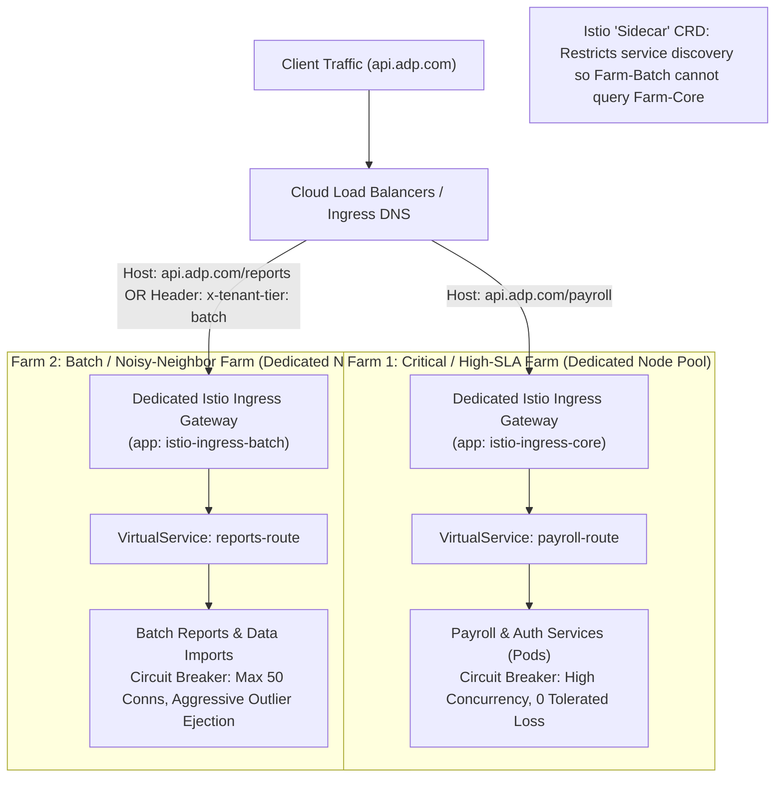

# Kinaxis Senior Cloud DevOps Engineer — Resume-Mapped Answers & Analogies
**Candidate:** Madhan Kumar S  
**Target Role:** Senior Cloud DevOps Engineer (Platform Engineering)  
**Company:** Kinaxis (RapidResponse Enterprise SaaS)  
**Interview Round:** Virtual Hiring Manager Round  
**Date/Time:** September 23, 2026 at 2:30 PM IST

---

## 🎯 Part 1: The 2-Minute Elevator Pitch ("Tell Me About Yourself")

> **Interviewer:** *"Walk me through your background and what you've been working on."*

### 🎙️ Your Exact Script:
> *"I'm a Senior Platform Engineer and SRE with over 6 years of experience architecting and operating high-scale cloud platforms, with a deep focus on Kubernetes, GitOps, and FinOps.*  
> 
> *Currently at **ADP India**, I lead core platform initiatives for our multi-tenant Kubernetes environments. Some of my key achievements include:  
> 1. Architecting a proprietary **'Farm-Based' routing and isolation model using Istio Service Mesh**, which completely eliminated noisy-neighbor latency spikes and protected tenant SLAs.  
> 2. Building custom platform tooling in **Golang and Python**—including a high-performance release observability dashboard that eliminated 8 hours of manual monitoring toil per release, and self-service infrastructure bots that slashed sandbox provisioning from **2 days to under 10 minutes**.  
> 3. Driving significant FinOps impact by combining **KEDA event-driven autoscaling** with Spot instances to cut testing compute spend by **80%**, while using **Karpenter** and **Cribl** to slash compute and Datadog/Splunk ingestion costs.  
> 
> *Prior to ADP, at **Genxlead Solutions**, I modernized monolithic workloads into microservices on AWS EKS, automated zero-downtime database migrations to Snowflake, and automated multi-account infrastructure using Terraform and Python.*  
> 
> *I am also a **Certified Argo Project Associate (CAPA)** and an AWS Certified Solutions Architect. What excites me about Kinaxis is your mission: RapidResponse powers mission-critical supply chains where availability, multi-tenant isolation, and zero-downtime delivery are paramount. My background designing self-service platforms, multi-tenant governance, and reliable cloud infrastructure maps directly to what your team is building."*

---

## 🗺️ Part 2: Resume-to-Kinaxis Tech Mapping Matrix

| Kinaxis Requirement (From JD) | Your Exact Resume Match | The Story & Quantifiable Metric |
|---|---|---|
| **Multi-Tenancy & Capsule** | **ADP:** Istio "Farm-Based" Routing & Isolation | Eliminated noisy neighbors and protected tenant SLAs by isolating workloads into logical farms. |
| **CI/CD Compute (ARC on GKE)** | **ADP:** Event-Driven KEDA Autoscaling (0 to 200 nodes) | Scaled from 0 to 200+ nodes dynamically; cut compute spend by 80% using Scale-to-Zero and Spot instances. |
| **Tooling in Go, Python & Bash** | **ADP:** Golang Release Dashboard + Python Infra Bots | Built Go logging engine (saved 8 man-hours/release) and Python bots (reduced lead time from 2 days to <10 mins). |
| **Argo CD & GitOps Delivery** | **ADP:** ArgoCD with AppSets & Microsoft SSO | **Certified Argo Project Associate (CAPA)**; built multi-tenant RBAC and automated app onboarding. |
| **Multi-Cloud & Identity** | **ADP:** Multi-Account Control Plane (Crossplane/Redash) | Automated cross-account IAM federation and data lakes (onboarding time from 3 days to 30 mins). |
| **FinOps & Cost Optimization** | **ADP:** Karpenter + KEDA + Shared Ingress + Cribl | Cut compute by 80%, shared load balancers, and slashed Datadog/Splunk log ingestion costs. |
| **Windows Server Automation** | **Genxlead:** Transition from Windows test framework | Modernized legacy Windows-based testing frameworks into automated container platforms. |

---

## 🎙️ Part 3: Deep Dives — Questions, Analogies & Scripts

---

### 1. Multi-Tenancy, Namespace Governance & Noisy Neighbors
*(Kinaxis Stack: GKE + Capsule Multi-Tenancy Operator)*

#### 🎯 The Question
> *"How do you handle multi-tenancy, namespace governance, and noisy neighbors in a shared Kubernetes environment?"*

#### 📄 Your Resume Match
* **ADP Key Achievement #1:** Proprietary Routing & Noisy Neighbor Mitigation using Istio Service Mesh.

#### 🏢 The Analogy: The International Airport Terminal Concourse
* **The Problem Without It:** Imagine an airport where international first-class passengers and a delayed budget charter flight with 400 tourists all share one single, narrow corridor to customs. The charter flight floods the corridor, creating a massive human bottleneck. First-class passengers miss their connecting flights (**SLA breaches and latency spikes**).
* **Your Solution at ADP:** You built **Dedicated Terminal Concourses ("Farms")**. Concourse A handles High-Priority Core Services; Concourse B handles Background Batch workloads. Each concourse has its own dedicated immigration gates, automated baggage conveyors (**circuit-breaking policies**), and strict passenger throughput meters (**rate limiting**). Even if Concourse B is completely flooded, Concourse A experiences zero interference and zero latency.
* **The Bridge to Kinaxis Capsule:** Capsule does this exact same thing at the Kubernetes namespace governance level: it leases out "Floors/Concourses" as `Tenant` CRDs, giving teams self-service namespaces while enforcing aggregate CPU/memory limits and isolating network policies!

#### 🎙️ Your 60-Second Senior Pitch:
> *"At ADP, our biggest platform challenge was multi-tenant contention on shared EKS clusters. We had bursty background services causing CPU throttling and latency spikes for mission-critical customer-facing workloads.*  
> 
> *I solved this by architecting a **proprietary 'Farm-Based' routing model using Istio Service Mesh**. I grouped related microservices into logical tenant farms with dedicated ingress points, strict circuit-breaking policies, connection pool limits, and rate-limiting rules at the gateway. Combined with Kubernetes ResourceQuotas and Pod Disruption Budgets, this completely eliminated cross-tenant interference and stabilized our 99.99% service SLAs.*  
> 
> *In Kinaxis’s architecture, using **Capsule on GKE** is the native Kubernetes control-plane counterpart to this. Capsule introduces the `Tenant` CRD, allowing developers to self-service namespaces within their tenant boundaries while enforcing aggregate CPU/memory quotas and restricting Ingress hostnames to pre-approved regexes. Combining Capsule for namespace governance with Service Mesh for traffic boundaries gives you ironclad enterprise multi-tenancy without cluster sprawl."*

---

#### 🛠️ Technical Implementation: How It Was Done Under the Hood (Architecture & YAML)

If the interviewer asks: *"Tell me more about how you actually implemented this 'Farm-Based' model in Istio under the hood. What did the architecture and CRDs look like?"*

Here is the exact architectural blueprint to explain:



##### 1. The 4 Structural Pillars of Farm-Based Routing:
1. **Split Ingress Gateways (Gateway Farms):** Instead of one monolithic `istio-ingressgateway` shared by everyone, we deployed separate Ingress Gateway controller deployments (`ingress-farm-core` and `ingress-farm-batch`) pinned to dedicated node pools via `nodeSelector` and taints/tolerations.
2. **Traffic Segmentation (`VirtualService`):** Traffic was steered based on Hostnames, URL prefixes (e.g. `/api/v1/core` vs. `/api/v1/batch`), or HTTP request headers (`x-tenant-tier: enterprise`).
3. **Circuit Breaking & Outlier Detection (`DestinationRule`):** Strict thresholds were applied to batch services so that if a batch backend slowed down, Envoy tripped the circuit breaker immediately instead of queuing connections and exhausting worker threads.
4. **Mesh Scope Isolation (`Sidecar` CRD):** In native Istio, every sidecar proxy receives configuration for every service in the cluster. We used the `Sidecar` CRD to scope service discovery strictly to the farm's namespace, cutting Envoy memory usage by 70% and preventing cross-farm network crosstalk.

##### 2. Real Production Istio YAML Manifests:

**A. Dedicated Ingress Gateway for the Core Farm (`Gateway` CRD):**
```yaml
apiVersion: networking.istio.io/v1beta1
kind: Gateway
metadata:
  name: farm-core-gateway
  namespace: istio-system
spec:
  # Selects dedicated Ingress pods running on dedicated compute nodes!
  selector:
    app: istio-ingressgateway-core
  servers:
  - port:
      number: 443
      name: https
      protocol: HTTPS
    tls:
      mode: SIMPLE
      credentialName: adp-core-cert
    hosts:
    - "api.adp.com"
```

**B. VirtualService Steering Traffic into the Core Farm (`VirtualService` CRD):**
```yaml
apiVersion: networking.istio.io/v1beta1
kind: VirtualService
metadata:
  name: payroll-core-vs
  namespace: farm-core
spec:
  hosts:
  - "api.adp.com"
  gateways:
  - istio-system/farm-core-gateway
  http:
  - match:
    - uri:
        prefix: /api/v1/payroll
    route:
    - destination:
        host: payroll-service.farm-core.svc.cluster.local
        port:
          number: 8080
      timeout: 5s
```

**C. Circuit Breaking & Outlier Detection for the Batch Farm (`DestinationRule` CRD):**
```yaml
apiVersion: networking.istio.io/v1beta1
kind: DestinationRule
metadata:
  name: batch-circuit-breaker
  namespace: farm-batch
spec:
  host: reports-service.farm-batch.svc.cluster.local
  trafficPolicy:
    connectionPool:
      tcp:
        maxConnections: 100 # Maximum TCP connections allowed
      http:
        http1MaxPendingRequests: 20 # Queue threshold before fast-failing!
        maxRequestsPerConnection: 10
    outlierDetection:
      consecutive5xxErrors: 3 # Eject instance after 3 consecutive failures
      interval: 10s
      baseEjectionTime: 30s # Quarantine pod for 30s
      maxEjectionPercent: 50
```

**D. Scoping Sidecar Discovery to the Farm Namespace (`Sidecar` CRD):**
```yaml
apiVersion: networking.istio.io/v1beta1
kind: Sidecar
metadata:
  name: farm-core-sidecar-scope
  namespace: farm-core
spec:
  # Prevents sidecars in farm-core from wasting memory tracking farm-batch services!
  egress:
  - hosts:
    - "./*" # Only services in the local namespace
    - "istio-system/*" # Core Istio control plane
```

---

### 2. CI/CD Compute Scaling & Ephemeral Runners
*(Kinaxis Stack: GitHub Actions + Actions Runner Controller (ARC) on GKE)*

#### 🎯 The Question
> *"How do you scale CI/CD infrastructure cost-effectively without leaving persistent security holes or paying for idle compute?"*

#### 📄 Your Resume Match
* **ADP Key Achievement #4:** Event-Driven Testing Infrastructure (KEDA) + Karpenter FinOps (0 to 200+ nodes, 80% savings).

#### 🚗 The Analogy: The Smart Restaurant Kitchen (Induction Burners vs. 200 Burning Ovens)
* **The Problem Without It:** Imagine running a commercial restaurant kitchen with 200 large gas ovens. To handle unexpected rushes, you leave all 200 ovens burning at 500°F 24 hours a day, 7 days a week (**static VM runners**). On Sunday night when zero customers are ordering, thousands of dollars in gas (**cloud compute**) are burned for nothing. But if you only keep 5 ovens on, when a party of 500 arrives, the kitchen collapses into massive order backlogs.
* **Your Solution at ADP:** You replaced static gas ovens with **Smart Induction Burners that click on instantly on demand (KEDA Event-Driven Autoscaling)**. When zero order tickets are on the wheel, the kitchen is completely dark (**Scale-to-Zero: $0 spend**). The instant 150 orders hit the queue, 150 induction burners materialize. As soon as the food is plated, they immediately shut off.
* **The Bridge to Kinaxis ARC on GKE:** This is the exact architectural pattern of **Actions Runner Controller (ARC) on GKE**. ARC listens to GitHub webhook events, spawns ephemeral container runner pods on GKE Spot nodes on demand, runs the build, and immediately destroys the pod.

#### 🎙️ Your 60-Second Senior Pitch:
> *"In large organizations, static CI/CD runners are an operational anti-pattern: they sit idle wasting compute at night, and they share state between builds, risking credential leaks and dirty caches.*  
> 
> *At ADP, I tackled this exact compute pattern when redesigning our Selenium testing grid on EKS. It was either under-provisioned, creating CI/CD bottlenecks, or over-provisioned, wasting thousands of dollars in idle compute. I re-architected it using **KEDA (Kubernetes Event-driven Autoscaling)** to scale dynamically from **0 to 200+ browser nodes** based strictly on queue depth. By enforcing Scale-to-Zero and running transient workers on Spot instances, we **slashed compute spend by ~80%** while increasing peak test execution throughput.*  
> 
> *This maps directly to how **Actions Runner Controller (ARC)** operates on GKE. ARC monitors GitHub workflow queues and spawns **ephemeral runner pods** on demand inside our private GCP VPC. The pods run on GKE Spot/Preemptible node pools, execute exactly one build with zero persistent attack surface, and terminate immediately. It gives developers instant pipeline capacity while delivering massive FinOps efficiency."*

---

### 3. Platform Engineering & Developer Self-Service Tooling
*(Kinaxis Stack: Go, Python, Bash platform automation & developer productivity)*

#### 🎯 The Question
> *"What is your philosophy on Platform Engineering, and have you built custom tools or controllers in Go and Python to eliminate developer toil?"*

#### 📄 Your Resume Match 
* **ADP Key Achievement #2 & Developer Productivity:** High-Performance Golang Release Engine + Python Infrastructure Automation Bots.

#### 🤖 The Analogy: The Automated Smart ATM vs. Waiting in Line for a Bank Teller
* **The Problem Without It:** Imagine a bank where every customer who wants to withdraw $20, check their balance, or open a temporary holiday savings jar has to stand in a 45-minute line, fill out a paper withdrawal slip, and wait for a manager's signature (**Ticket-Ops: developers waiting 2 days for sandbox environments**). The bank staff spends their entire day processing repetitive paperwork (**8 hours of manual monitoring per release**).
* **Your Solution at ADP:** You built **Automated Smart ATMs (Self-Service Infrastructure Bots in Python and Go)**. The developer runs a command, the bot validates security policies automatically, provisions a fully compliant sandbox environment within 8 minutes, and schedules it to self-destruct in 7 days. Concurrently, you built a **Live Airport Radar Screen (the Golang release logging engine)** so operations teams can watch promotions land in real time instead of calling 50 engineers.

#### 🎙️ Your 60-Second Senior Pitch:
> *"My philosophy is that Platform Engineering should treat the infrastructure as an internal product, creating 'golden paths' that eliminate operational toil.*  
> 
> *At ADP, our operations team was spending roughly **8 hours per release cycle manually monitoring application promotions** across environments, with no unified audit trail. To fix this, I engineered a high-performance **logging engine and live dashboard in Golang** that ingested promotion events and visualized release health in real time. That eliminated 100% of manual monitoring toil—**saving 8 man-hours per release**—and provided an immutable audit trail for velocity analysis.*  
> 
> *Additionally, developers previously had to wait 2 days for sandbox environments via Jira tickets. I built custom **Infrastructure Automation Bots in Python and Go** integrated with our ticketing and PR workflows. Developers could self-service sandbox environments with built-in compliance guardrails, reducing lead time from **2 days to under 10 minutes**.*  
> 
> *At Kinaxis, I would apply this exact mindset: writing CLI tools, controllers, and automation in Go and Python to turn infrastructure into seamless self-service APIs."*

---

### 4. GitOps Delivery & Automated Drift Healing
*(Kinaxis Stack: Argo CD, ApplicationSets, Helm, YAML environment overlays)*

#### 🎯 The Question
> *"How do you maintain continuous delivery and prevent configuration drift across dozens of microservices deployed over multiple clusters without using push-based CI scripts?"*

#### 📄 Your Resume Match
* **Certifications & ADP Responsibilities:** Certified Argo Project Associate (CAPA) + ArgoCD with AppSets and Microsoft SSO.

#### 🚢 The Analogy: The Autopilot Cargo Vessel vs. The Cross-Country Delivery Truck
* **The Problem Without It:** Push-based CI is like a delivery truck driver with the master keys to every building in the country. The CI runner holds `cluster-admin` credentials. If an engineer makes a manual emergency tweak at 2 AM using `kubectl edit` directly in production, the change is never recorded in Git, and the cluster drifts into an unknown, unreproducible state.
* **Your Solution at ADP:** An **Autopilot Cargo Vessel (Argo CD)** that continuously checks its real-time GPS coordinates against the Nautical Chart (**Git repository**). Argo CD lives *inside* the cluster. If anyone manually tampers with a valve or dial (`kubectl patch`), Argo CD detects the drift within seconds and **automatically snaps it back to the declared Git state** (`selfHeal: true`).
* **Scaling with ApplicationSets:** A single master blueprint that stamps out 50 cargo ships at once whenever a new folder is added to Git.

#### 🎙️ Your 60-Second Senior Pitch:
> *"I am a **Certified Argo Project Associate (CAPA)**, and at ADP, I designed and maintained our enterprise ArgoCD implementation.*  
> 
> *To eliminate cluster drift and avoid the security risks of push-based CI, we adopted strict pull-based GitOps. We integrated ArgoCD with **Microsoft SSO** to enforce multi-tenant RBAC, ensuring development squads could only sync workloads within their assigned namespaces.*  
> 
> *To scale this across multiple environments and clusters, I leveraged **ArgoCD ApplicationSets**. Using Git directory and cluster generators, a single master ApplicationSet dynamically onboarded new services and clusters without requiring engineers to write boilerplate manifests. We configured automated self-healing (`selfHeal: true`) and pruning, so if an engineer manually alters a pod in production using `kubectl`, ArgoCD immediately detects the drift and reverts the cluster back to the Git source of truth within seconds."*

---

### 5. Multi-Cloud Transition: Bridging AWS to Google Cloud (GCP/GKE)
*(Kinaxis Stack: GCP preferred, GKE, Shared VPC, Workload Identity)*

#### 🎯 The Question
> *"Your resume is heavily AWS-focused (EKS, VPC, Route53, IAM). How quickly can you adapt to our Google Cloud (GCP/GKE) platform?"*

#### 📄 Your Resume Match
* **ADP Key Achievement #3:** Multi-Account Analytics Control Plane (Crossplane & Redash across 5 AWS accounts) + **Genxlead Multi-Cloud Deployments**.

#### 🌐 The Analogy: Speaking Portuguese when you already speak Spanish
* **The Core Insight:** Distributed systems principles are identical across cloud providers—only the dial tones and CLI syntax differ.
* **1:1 Mental Mapping:**
  * **EKS IRSA** = **GCP Workload Identity Federation (WIF)** (Exchanging K8s JWT for cloud tokens; zero static JSON keys).
  * **AWS Regional VPC + Transit Gateway** = **GCP Global Shared VPC** (Host Project shares subnets directly with GKE Service Projects with zero peering hops).
  * **AWS PrivateLink** = **GCP Private Service Connect (PSC)** (Private service consumption without CIDR overlap).
  * **Crossplane & Terraform:** The declarative control plane that abstracts both clouds.

#### 🎙️ Your 60-Second Senior Pitch:
> *"At the Senior Platform level, cloud providers are different APIs implementing identical distributed systems principles. Kubernetes itself is the common abstraction layer. Because GKE is upstream-native Kubernetes, my deep operational experience in EKS, networking, controllers, and Helm transfers immediately.*  
> 
> *The architectural concepts map 1-to-1:*  
> *• In AWS, I used **IRSA (IAM Roles for Service Accounts)**; in GCP, that is **Workload Identity Federation**, binding K8s ServiceAccounts to Google ServiceAccounts to eliminate static JSON keys.*  
> *• In AWS, networking is regional and requires Transit Gateways; in GCP, VPCs are **global by default**, and **Shared VPC** allows a central Host Project to share subnets directly with GKE Service Projects with zero peering hops.*  
> *• In AWS, I automated multi-account IAM roles and data federation across 5 accounts using **Crossplane** to build an Analytics Hub; the same federated identity and IaC principles apply when managing GCP Projects and Organizations.*  
> 
> *Because I manage all infrastructure as code using **modular Terraform**, switching providers is simply a matter of changing resource definitions while keeping the core architecture, security boundaries, and CI/CD pipelines identical."*

---

### 6. FinOps & Compute/Observability Cost Optimization
*(Kinaxis Stack: Tracking platform health, cloud usage, and cost optimization initiatives)*

#### 🎯 The Question
> *"How do you approach FinOps and cost optimization in high-scale cloud platforms?"*

#### 📄 Your Resume Match
* **ADP FinOps & Scaling + Observability:** Karpenter Node Provisioning + KEDA 80% Reduction + Shared Ingress + Cribl Log Reduction.

#### 📦 The Analogy: The Automated Tetris Packing Machine & The Postal Shredder
* **The Problem Without It:**
  1. Shipping envelopes by booking entire Boeing 747s (large static EC2 instances with 85% idle capacity).
  2. Hiring a private police escort motorcade for every single commuter car (a separate $30/month cloud load balancer for every microservice).
  3. Paying luxury climate-controlled vault storage fees for junk mail and packing peanuts (raw debug logs ingested into Datadog/Splunk).
* **Your Solution at ADP:**
  1. **Karpenter:** A robotic Tetris packing master that packs pods into the exact right-sized compute nodes just-in-time and consolidates empty nodes immediately.
  2. **Shared Ingress:** A high-capacity city bus (reusable load balancers) carrying all microservices through a single gateway.
  3. **Cribl:** A postal sorting machine that filters, deduplicates, and shreds junk logs before they touch Datadog/Splunk, slashing ingestion bills by huge margins.

#### 🎙️ Your 60-Second Senior Pitch:
> *"FinOps is not just about reviewing a monthly invoice—it must be architected directly into the platform compute, networking, and observability layers.*  
> 
> *At ADP, I drove FinOps across three major vectors:*  
> 1. * **Compute Right-Sizing & Node Provisioning:** I implemented **Karpenter** for just-in-time, consolidation-aware node provisioning, eliminating the idle buffer waste common with standard Cluster Autoscaler. Combined with **KEDA Scale-to-Zero** on testing infrastructure, we cut test compute spend by **~80%** using Spot instances.*  
> 2. * **Ingress Consolidation:** Rather than letting every service provision its own cloud Load Balancer ($20–$30/month each), I established a shared Ingress Controller architecture with reusable Load Balancers, drastically reducing monthly networking costs.*  
> 3. * **Observability FinOps:** Observability bills often grow faster than compute. I architected the migration of our log pipelines to **Cribl**, implementing log routing, deduplication, and filtering before ingestion into Datadog and Splunk, slashing ingestion costs significantly.*  
> 
> *At Kinaxis, I would establish similar automated metrics and cost dashboards to ensure our GKE clusters and cloud resources scale down aggressively during non-peak windows."*

---

### 7. Windows Server & Legacy Enterprise Modernization
*(Kinaxis Stack: Windows Server administration, automation & lifecycle management)*

#### 🎯 The Question
> *"Kinaxis RapidResponse uses Windows Server for calculation engines alongside Linux. What is your experience with Windows environments, and how do you modernize or automate them?"*

#### 📄 Your Resume Match
* **Genxlead Achievement:** Test Automation Modernization (transitioned Windows-based manual framework to fully automated Kubernetes on AWS EKS).

#### 🏗️ The Analogy: Converting Hand-Cranked Printing Presses into Automated Digital Presses
* **The Problem Without It:** Workers manually feeding individual sheets of paper into mechanical, hand-cranked Windows machines. It took hours of manual clicking, broke down during peak printing rushes, and couldn't scale.
* **Your Solution at Genxlead:** You led the migration that transitioned manual Windows-based test automation to a fully automated, elastic containerized infrastructure on EKS with AWS Fargate, enabling the platform to absorb 80% more jobs without human intervention.
* **The Bridge to Kinaxis:** You understand both sides: how to operate Windows Server headlessly via **Ansible over WinRM** (for OS baseline hardening and WSUS patching), and how to modernize enterprise services into cloud-native containers.

#### 🎙️ Your 60-Second Senior Pitch:
> *"Early in my career at Genxlead, our core test automation ran on a manual Windows-based framework that was labor-intensive, slow, and unable to absorb peak loads. I spearheaded the project that modernized that framework into an automated, Kubernetes-backed architecture on AWS EKS with Fargate profiles, eliminating 100% of manual effort and enabling the platform to handle 80% more test jobs during peak surges.*  
> 
> *In enterprise SaaS platforms like Kinaxis, in-memory calculation engines often run on Windows Server while the platform runs on Linux/K8s. My philosophy is that Windows machines should never be treated as manual pets that engineers access via RDP. I automate Windows fleets using **Ansible over WinRM with HTTPS certificates** to enforce OS baseline hardening, registry configurations, and automated WSUS patching. This gives you consistent, declarative infrastructure-as-code across both your Windows and Linux fleets."*

---

## ⚡ Summary of Your Key Numbers to Drop in the Interview

* **80%**: Compute spend reduction using KEDA Scale-to-Zero and Spot instances.
* **8 hours**: Manual release monitoring toil saved per release cycle using your Golang engine.
* **2 days to <10 minutes**: Lead time reduction for developer sandbox provisioning using Python/Go bots.
* **5 AWS Accounts**: Centralized into a single Analytics Control Plane using Crossplane and Redash.
* **CAPA**: Certified Argo Project Associate (proves your deep GitOps and ApplicationSet mastery).
* **3 days to 30 minutes**: Data-source onboarding time reduction through federated SQL access.
