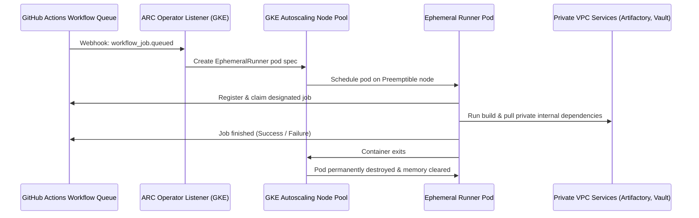
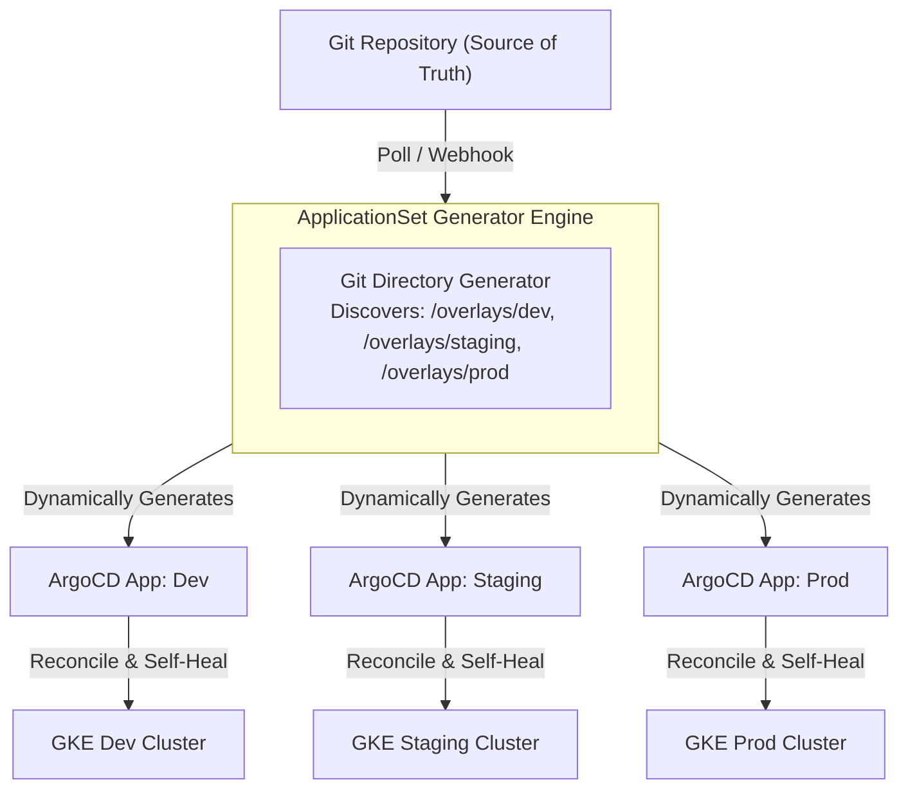
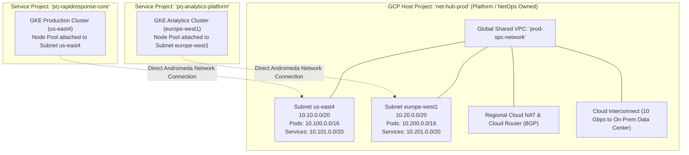
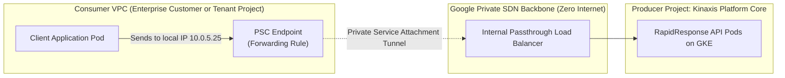
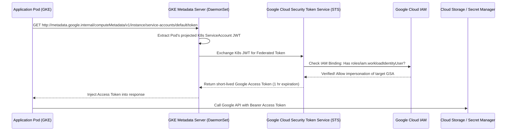
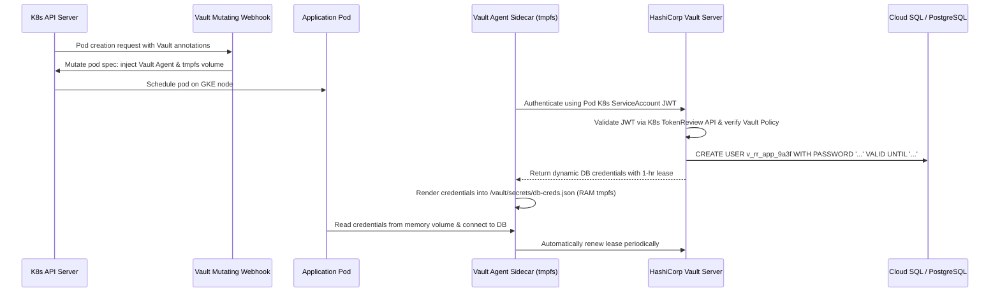
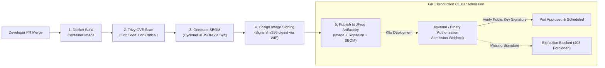

# Kinaxis Senior Cloud DevOps Engineer — Master Concepts & Analogies Guide
**Target Role:** Senior Cloud DevOps Engineer (Platform Engineering)  
**Company:** Kinaxis (RapidResponse Enterprise SaaS)  
**Location:** Chennai, India  
**Date Created:** September 22, 2026  
**Purpose:** Exhaustive, senior-level interview preparation with deep narrative analogies, side-by-side comparison tables, production YAML/code, and exact interview delivery scripts.

---

## 📑 Table of Contents

### Module 1: Kubernetes Platform & Delivery
1. [Capsule: Kubernetes Multi-Tenancy Operator](#1-capsule-kubernetes-multi-tenancy-operator)
2. [Actions Runner Controller (ARC) on GKE](#2-actions-runner-controller-arc-on-gke)
3. [Argo CD & GitOps with ApplicationSets](#3-argo-cd--gitops-with-applicationsets)

### Module 2: Cloud Infrastructure & Networking (The GCP Bridge)
4. [GCP Shared VPC vs. AWS Transit Gateway & RAM](#4-gcp-shared-vpc-vs-aws-transit-gateway--ram)
5. [Private Service Connect (PSC) vs. AWS PrivateLink](#5-private-service-connect-psc-vs-aws-privatelink)

### Module 3: Zero-Trust Security & Identity
6. [GCP Workload Identity Federation (WIF) vs. AWS IRSA](#6-gcp-workload-identity-federation-wif-vs-aws-irsa)
7. [HashiCorp Vault on Kubernetes (Dynamic Secrets & Sidecars)](#7-hashicorp-vault-on-kubernetes-dynamic-secrets--sidecars)
8. [Container Supply Chain Security (Trivy, SBOM, Cosign)](#8-container-supply-chain-security-trivy-sbom-cosign)

### Module 4: Enterprise Automation & Hybrid Operations
9. [Ansible for Windows Server Automation (WinRM & Hybrid Fleets)](#9-ansible-for-windows-server-automation-winrm--hybrid-fleets)
10. [Terraform Layered Architecture & Blast Radius Management](#10-terraform-layered-architecture--blast-radius-management)

### Module 5: SRE, Reliability & Incident Operations
11. [Production Incident Triage, SRE & Blameless Post-Mortems](#11-production-incident-triage-sre--blameless-post-mortems)

---

# Module 1: Kubernetes Platform & Delivery

---

## 1. Capsule: Kubernetes Multi-Tenancy Operator

### 🎯 The Interview Question
> *"In a large enterprise SaaS platform like Kinaxis RapidResponse, how do you provide hundreds of microservice developers with self-service namespace provisioning on shared GKE clusters without risking cluster sprawl, runaway costs, or security compromises?"*

---

### 🏢 The Deep Narrative Analogy: The High-Rise Commercial Office Tower
Imagine you are the facility director of a massive 50-story commercial skyscraper:
* **The GKE Cluster** = The entire office skyscraper (shared steel foundation, central power generators, elevator banks, water mains, and perimeter security).
* **The Platform Engineer (You)** = The building owner and chief facility manager (`cluster-admin`).
* **The Engineering Teams (Tenants)** = The different corporate divisions leasing space (e.g., Supply Chain Planning squad, Billing squad, Analytics squad).

#### The Nightmare of Vanilla Kubernetes (Single Rooms):
In vanilla Kubernetes, the only native isolation unit is a **Namespace**. That is the equivalent of the building manager giving each corporate department **a single locked room**:
1. **The Ticket Bottleneck:** Whenever the Billing team wants to build a new private cubicle, a small meeting room, or a storage closet (e.g., `dev`, `staging`, `feature-auth-test` namespaces), they cannot do it themselves. In vanilla K8s, creating a namespace requires master building keys (`cluster-admin`). The tenant has to submit a Jira ticket to the building landlord every single time. The platform team becomes a glorified room-unlocking service desk.
2. **Quota Fragmentation:** If the landlord allocates 50 sq ft of space to Room A and 50 sq ft to Room B, vanilla K8s evaluates quotas *only per individual room*. The landlord has no way of saying: *"The Billing department is leased 10,000 sq ft in total; carve it into however many rooms you want, but your combined total cannot exceed 10,000 sq ft."*
3. **Resource Hijacking:** Nothing stops an aggressive tenant from taking over the building's luxury high-speed elevator (claiming expensive NVMe SSD `StorageClasses`) or sticking their own corporate banner over the main building lobby entrance (hijacking a shared `Ingress` hostname like `api.kinaxis.com`).

#### Enter Capsule: Leasing Entire Floors with Smart Guardrails
Instead of managing individual rooms, Capsule lets the building manager **lease an entire private floor to a Tenant**:
* The landlord gives Team Billing the master keycard to **Floor 4**.
* Capsule programs the electronic turnstiles with the **Floor Lease Terms**:
  - *"You have an aggregate budget of 10,000 sq ft (64 CPUs, 256GB RAM) across your entire floor."*
  - *"You may construct up to 10 sub-offices (namespaces) inside your floor autonomously."*
  - *"Your external signage must match the template `*.billing.kinaxis.com` (allowed Ingress hostnames)."*
  - *"You are restricted to standard plumbing (standard `StorageClasses`)."*
* Within Floor 4, Team Billing can construct, tear down, and reconfigure sub-offices (e.g., `billing-dev`, `billing-staging`, `billing-pr-402`) in seconds without ever calling the landlord. Capsule automatically makes sure the soundproofing walls between Floor 4 and Floor 5 remain sealed (`NetworkPolicies`).

---

### ⚠️ The Problem Without Capsule (Detailed Technical Impact)
1. **Cluster Sprawl:** To avoid giving developers `cluster-admin` privileges, organizations take the easy way out: spinning up a separate GKE cluster for every squad or customer. This leads to 40+ clusters, massive control-plane management costs, fragmented observability, and upgrade nightmares.
2. **Namespace Sprawl Without Aggregate Controls:** When teams share a cluster, native `ResourceQuota` objects only apply inside one namespace. If a team creates 5 namespaces, each with a 10-CPU limit, they can consume 50 CPUs, starving other workloads and causing noisy-neighbor CPU throttling.
3. **Ingress Collisions:** In native K8s, any developer can write an Ingress manifest claiming `host: app.kinaxis.com`. If two teams claim the same host, the ingress controller enters an unstable state or routes traffic to the wrong tenant.

---

### 💡 The Solution With Capsule
Capsule introduces the **`Tenant` Custom Resource Definition (CRD)**. An admission controller webhook intercepts all namespace creation requests:
* **Self-Service:** Developers belonging to an OIDC group (e.g., `oidc:billing-team`) can run `kubectl create namespace billing-feature-x`. Capsule intercepts the call, verifies tenant membership, and assigns the namespace.
* **Aggregate Quotas:** Resource usage across all namespaces belonging to the `Tenant` is aggregated and enforced in real time.
* **Automated Guardrails:** Capsule automatically injects `NetworkPolicies` to isolate tenant pods, enforces regex rules on `Ingress` hosts, restricts `StorageClasses`, and injects node taints/tolerations for dedicated hardware.

---

### 📊 Side-by-Side Comparison: Vanilla K8s vs. Capsule

| Operational Dimension | Vanilla Kubernetes | With Capsule Operator |
|---|---|---|
| **Namespace Creation** | Requires `cluster-admin` (Manual Ticket to Platform Team) | **Autonomous Self-Service** by developers in designated OIDC groups |
| **Resource Quotas** | Siloed per individual namespace | **Aggregate Quota** enforced across all namespaces owned by the Tenant |
| **Ingress Domain Security** | Any namespace can claim any hostname | Restricted to regex pattern (e.g., `^.*\.billing\.kinaxis\.com$`) |
| **Storage Governance** | Unrestricted access to any cluster StorageClass | Enforced whitelist of allowed StorageClasses per Tenant |
| **Network Isolation** | Engineers must manually write and maintain NetworkPolicies | **Automated Zero-Trust Isolation** between namespaces of different Tenants |
| **Infrastructure Footprint** | 40+ small GKE clusters (Expensive cluster sprawl) | **3-5 large, resilient multi-tenant GKE clusters** (FinOps optimized) |

---

### ⚙️ Under the Hood: Production Capsule Architecture & CRD

```
[ GKE Cluster (Physical Compute / Control Plane) ]
   │
   ├── Tenant: "rapidresponse-core" (Floor 3)
   │     ├── Quota: 128 CPUs, 512GB RAM across all child namespaces
   │     ├── Allowed Ingress: *.core.kinaxis.com
   │     ├── Allowed Storage: gke-balanced-csi
   │     └── Dynamic Child Namespaces: [ core-dev ] [ core-staging ] [ core-hotfix ]
   │
   └── Tenant: "supplychain-analytics" (Floor 4)
         ├── Quota: 64 CPUs, 256GB RAM across all child namespaces
         ├── Allowed Ingress: *.analytics.kinaxis.com
         ├── Allowed Storage: gke-standard-csi
         └── Dynamic Child Namespaces: [ analytics-sandbox ] [ analytics-prod ]
```

#### Production Capsule Tenant CRD Manifest:
```yaml
apiVersion: capsule.clastix.io/v1beta2
kind: Tenant
metadata:
  name: rapidresponse-core
spec:
  owners:
  - name: oidc:rapidresponse-core-devs
    kind: Group
  namespaceOptions:
    quota: 10 # Maximum 10 namespaces for this tenant
    additionalMetadata:
      labels:
        kinaxis.com/cost-center: "engineering-core"
        kinaxis.com/tier: "tier-1"
  resourceQuotas:
    scope: Tenant # AGGREGATE ENFORCEMENT ACROSS ALL NAMESPACES
    items:
    - hard:
        limits.cpu: "128"
        limits.memory: 512Gi
        requests.cpu: "64"
        requests.memory: 256Gi
        pods: "200"
  ingressOptions:
    allowedHostnames:
      allowedRegex: "^.*\\.core\\.kinaxis\\.com$"
  storageClasses:
    allowed:
    - gke-balanced-csi
    - gke-standard-csi
  networkPolicies:
    items:
    - ingress:
      - from:
        - namespaceSelector:
            matchLabels:
              capsule.clastix.io/tenant: rapidresponse-core
```

---

### 🎙️ The 60-Second Senior Pitch (What to Say to the Hiring Manager)
> *"In enterprise SaaS environments like Kinaxis, platform teams inevitably face the **Cluster Sprawl vs. Noisy Neighbors dilemma**. Running a separate GKE cluster for every squad or customer tenant creates massive control-plane cost and maintenance overhead. But running a flat cluster leads to ticket bottlenecks because standard K8s requires cluster-admin rights just to provision a namespace.*  
> *That’s why I advocate for **Capsule**. It introduces the **Tenant abstraction layer**:*  
> *1. It empowers feature teams with **self-service namespace creation** without handing out dangerous cluster-level roles.*  
> *2. It enforces **aggregate resource quotas** across all namespaces owned by that tenant, preventing noisy-neighbor starvation.*  
> *3. It natively injects governance guardrails—restricting Ingress hostnames to authorized regex domains, whitelisting permitted StorageClasses, and isolating tenant traffic via automated NetworkPolicies.*  
> *At ADP, I solved tenant isolation at the data-plane level using Istio routing farms; Capsule provides the native Kubernetes control-plane governance for that exact same multi-tenancy challenge."*

---

## 2. Actions Runner Controller (ARC) on GKE

### 🎯 The Interview Question
> *"How do you design a scalable, secure, and cost-effective CI/CD runner platform for 500+ engineers that requires access to private cloud infrastructure without exposing credentials or wasting compute?"*

---

### 🚗 The Deep Narrative Analogy: Public Taxis vs. Self-Destructing Drone Fleet
Imagine orchestrating ground transport for thousands of secret VIP agents across an enterprise:
* **GitHub-Hosted Public Runners** = **Public City Taxis**. Convenient for hail-and-ride personal trips, but they are expensive per minute. More critically, public city taxis are not allowed inside your private military base (they cannot reach your internal GCP VPC, private GKE clusters, or internal databases) without punching dangerous holes in your perimeter security.
* **Static Self-Hosted VM Runners** = **Buying 100 private limousines that sit parked 24/7 with the engines running**. You pay for compute around the clock, even on weekends and holidays when nobody is building code. Furthermore, if a passenger spills coffee, leaves classified documents in the glove compartment, or installs malware on the dashboard (dirty build caches, leaked tokens on disk), the next agent who steps into that limousine inherits that compromised state.
* **Actions Runner Controller (ARC) on GKE (The Solution)** = **An Automated Factory of Ephemeral Drone Couriers.**
  When an engineer pushes code, GitHub sends an encrypted webhook: *"New build job waiting in queue."* ARC immediately commands GKE: *"Materialize a sterile container runner pod inside our private VPC."* The runner executes the build, runs integration tests against private VPC services, uploads the artifact to Artifactory, and **instantly self-destructs**. The container pod is permanently deleted. The next build receives a brand-new, sterile pod with zero memory of previous jobs.

---

### ⚠️ The Problem Without ARC
1. **Network Inaccessibility:** GitHub-hosted runners cannot reach private GKE clusters, internal HashiCorp Vault endpoints, or private artifact registries without deploying complex reverse tunnels or opening public firewall ports.
2. **FinOps Waste:** Static GCE/EC2 VMs running GitHub runner services must be sized for peak Monday morning loads. During nights and weekends, they sit 90% idle while racking up compute bills.
3. **State Contamination & Security Leaks:** If Build #1 clones a repo and writes credentials to `/tmp/creds`, Build #2 on the same static runner can read that directory. Compromising one repository allows lateral movement across all other builds running on that shared runner.

---

### 💡 The Solution With ARC
**Actions Runner Controller (ARC)** is a Kubernetes operator running inside GKE that manages the lifecycle of self-hosted GitHub Actions runners:
* **Private Network Ingress/Egress:** Runners execute as native pods inside the private GKE cluster, inheriting private VPC routing, DNS, and IAM via Workload Identity.
* **Autoscaling from Zero:** ARC listens to GitHub webhook events or metrics (queued workflow jobs) and scales ephemeral runner pods from 0 to 200+ within seconds.
* **Ephemeral Runner Lifecycle:** Each runner pod accepts **exactly one job**. Once the job finishes, the pod is terminated and destroyed, guaranteeing zero persistent state or credential retention.
* **FinOps Optimization:** Runner pods run on **Spot / Preemptible GKE node pools**, reducing compute costs by up to 70–80%.

---

### 📊 Side-by-Side Comparison: Static VM Runners vs. ARC on GKE

| Feature | Static Self-Hosted VMs | Actions Runner Controller (ARC) on GKE |
|---|---|---|
| **Lifecycle Model** | Long-running "Pet" VMs (never destroyed) | **Ephemeral "Cattle" Pods** (destroyed after 1 job) |
| **State Cleanliness** | Shared disk across builds (dirty cache, credential leak risk) | **100% Sterile Environment** for every individual job |
| **Scaling Dynamics** | Static capacity; slow VM boot times (5–10 minutes) | **Rapid Container Autoscaling** (pod starts in seconds) |
| **Cost Efficiency** | 24/7 compute billing regardless of queue depth | **Scale-to-Zero** on weekends; runs on Spot/Preemptible nodes |
| **VPC & IAM Integration** | Requires manual IAM key distribution on VMs | Native **GCP Workload Identity**; zero static cloud credentials |
| **Maintenance Overhead** | Manual OS patching, disk cleanup scripts, runner upgrades | Automated operator updates; zero OS maintenance |

---

### ⚙️ Under the Hood: ARC Controller Architecture & Manifest



#### Production ARC `AutoscalingRunnerSet` Manifest:
```yaml
apiVersion: actions.github.com/v1alpha1
kind: AutoscalingRunnerSet
metadata:
  name: gke-ephemeral-runners
  namespace: arc-runners
spec:
  githubConfigUrl: "https://github.com/kinaxis"
  githubConfigSecret: github-app-credentials
  minRunners: 0 # SCALE TO ZERO WHEN IDLE!
  maxRunners: 150
  template:
    spec:
      serviceAccountName: arc-runner-gsa-bound # Uses Workload Identity!
      nodeSelector:
        cloud.google.com/gke-spot: "true" # FinOps: 70% cheaper
      containers:
      - name: runner
        image: ghcr.io/actions/actions-runner:latest
        command: ["/home/runner/run.sh"]
        resources:
          requests:
            cpu: "2"
            memory: "4Gi"
          limits:
            cpu: "4"
            memory: "8Gi"
        securityContext:
          readOnlyRootFilesystem: false
          allowPrivilegeEscalation: false
```

---

### 🎙️ The 60-Second Senior Pitch (What to Say to the Hiring Manager)
> *"Managing static VM runners is one of the most common operational anti-patterns in enterprise CI/CD: it creates 24/7 idle waste, requires constant disk cleanup scripts, and risks cross-build credential contamination.*  
> *By deploying **Actions Runner Controller (ARC) on GKE**, we treat CI/CD compute as an **event-driven, ephemeral platform**. Runners operate as native pods inside our private GCP VPC, meaning they securely reach internal registries, GKE APIs, and HashiCorp Vault without public IP exposure. The operator scales runner pods dynamically from zero based on GitHub webhook queue depth, running on Spot/Preemptible node pools to maximize FinOps efficiency. Because every runner pod is terminated immediately after executing a single job, we guarantee zero state leakage, eliminate persistent attack surfaces, and provide developers with blazing-fast, consistent pipeline execution."*

---

## 3. Argo CD & GitOps with ApplicationSets

### 🎯 The Interview Question
> *"How do you maintain continuous delivery and prevent configuration drift across dozens of microservices deployed over multiple clusters and environments without using dangerous push-based CI scripts?"*

---

### 🚢 The Deep Narrative Analogy: The Autopilot Cargo Vessel
Imagine navigating a global fleet of 100 modern cargo vessels across different oceans:
* **Traditional Deployment (CI Push)** = **A Delivery Driver driving a truck across state lines**. Your CI pipeline (GitHub Actions) holds full cluster-admin credentials and runs `kubectl apply` directly into production. If the network drops halfway, if someone manually edits a pod in production (`kubectl edit`), or if credentials leak from CI, the cluster drifts and nobody knows what state production is actually in.
* **Argo CD (GitOps Controller)** = **An Autonomous Autopilot System on board each ship**.
  The Nautical Navigation Chart is your **Git repository** (the single source of truth). Argo CD lives *inside* the cluster as an autonomous controller. It never accepts external commands pushed from the outside. Instead, every 3 minutes, it compares what is running on the ship against the Nautical Chart in Git. If a rogue crew member manually turns a valve or adjusts a throttle in the engine room (`kubectl edit`), Argo CD immediately sounds an alert, declares "Out of Sync", and **automatically overwrites the physical state back to match the chart** (Self-Healing).
* **ApplicationSets (The Multiplier)** = **A Single Master Blueprint that coordinates the entire fleet at once.**
  Instead of an engineer manually authoring 100 individual ArgoCD `Application` files for Dev, Staging, QA, and Prod clusters, an ApplicationSet uses **generators**. If you commit a new folder called `clusters/tokyo-prod` or `apps/billing-service` into Git, the ApplicationSet generator automatically detects it and stamps out the deployment across the appropriate clusters automatically.

---

### ⚠️ The Problem Without GitOps & AppSets
1. **Security Vulnerability (The "God-Mode" CI Pipeline):** In traditional push CI, the GitHub Actions runner must hold cluster-admin kubeconfig credentials. If a third-party dependency in CI is compromised, the attacker has administrative control of your production Kubernetes cluster.
2. **Undetected Configuration Drift:** During an outage at 2 AM, an engineer runs `kubectl scale deployment api --replicas=20` or edits an environment variable directly. The incident is resolved, but the manual change is never committed to Git. Three weeks later, a new deployment wipes out the hotfix, triggering another outage.
3. **Application Sprawl:** Managing 30 microservices across 4 environments (Dev, QA, Staging, Prod) across 3 cloud regions requires maintaining 360 separate boilerplate ArgoCD manifests.

---

### 💡 The Solution With Argo CD & ApplicationSets
1. **Pull-Based Security:** Argo CD runs inside the cluster and pulls manifests from Git. No incoming firewall ports are opened, and CI runners never hold cluster-admin credentials.
2. **Continuous Drift Detection & Self-Healing:** Argo CD continuously runs a reconciliation loop comparing the live Kubernetes state with target state in Git. If drift occurs, `selfHeal: true` automatically reverts the unauthorized change.
3. **ApplicationSet Generators:** A single ApplicationSet manifest uses `Git` or `Cluster` generators to dynamically discover environments and deploy applications across multi-tenant, multi-cluster topologies.

---

### 📊 Side-by-Side Comparison: Push CI/CD vs. Pull GitOps (Argo CD)

| Dimension | Push-Based CI (GitHub Actions / Jenkins) | Pull-Based GitOps (Argo CD + AppSets) |
|---|---|---|
| **Credential Storage** | Cluster-admin kubeconfig stored inside CI system | **Zero cluster credentials outside the cluster** |
| **Firewall Ingress** | Kubernetes API must be exposed to CI runners | Kubernetes API remains completely private |
| **Drift Detection** | Blind to manual changes made via `kubectl` | **Continuous drift monitoring** (flags OutOfSync in real time) |
| **Self-Healing** | None; manual changes persist indefinitely | **Automated self-healing** overwrites manual drift |
| **Audit & Rollback** | Rollback requires re-running complex pipeline jobs | **`git revert`** instantly rolls back production in seconds |
| **Multi-Cluster Scaling** | Write separate pipeline jobs per cluster | **ApplicationSets dynamically stamp out deployments** |

---

### ⚙️ Under the Hood: Production ApplicationSet Architecture & Code



#### Production ApplicationSet with Git Generator:
```yaml
apiVersion: argoproj.io/v1alpha1
kind: ApplicationSet
metadata:
  name: rapidresponse-microservices
  namespace: argocd
spec:
  generators:
  - git:
      repoURL: https://github.com/kinaxis/cloud-platform-manifests.git
      revision: HEAD
      directories:
      - path: services/*/* # Matches services/<app-name>/overlays/<env>
  template:
    metadata:
      name: '{{path[1]}}-{{path[3]}}' # e.g. billing-prod
    spec:
      project: default
      source:
        repoURL: https://github.com/kinaxis/cloud-platform-manifests.git
        targetRevision: HEAD
        path: '{{path}}'
      destination:
        server: https://kubernetes.default.svc
        namespace: '{{path[3]}}'
      syncPolicy:
        automated:
          prune: true     # Deletes resources removed from Git
          selfHeal: true  # Overwrites manual kubectl tampering!
        syncOptions:
        - CreateNamespace=true
```

---

### 🎙️ The 60-Second Senior Pitch (What to Say to the Hiring Manager)
> *"Pushing deployments directly from CI runners using `kubectl apply` is an operational security liability: it forces you to store cluster-admin keys in CI, and it has zero ability to detect or remediate configuration drift.*  
> *I design delivery platforms around **pull-based GitOps using Argo CD**. The cluster reconciles its own live state against Git. If an engineer manually alters a deployment in production, Argo CD’s self-healing loop automatically snaps it back to the declared Git state, providing an immutable audit trail.*  
> *To scale this across Kinaxis's microservices and multi-cluster environments, I leverage **ApplicationSets**. Using directory and cluster generators, a single ApplicationSet dynamically onboards new services and clusters without requiring engineers to write boilerplate manifests. At ADP, this architecture allowed us to support multi-tenant releases across hundreds of environments with automated rollbacks and zero manual intervention."*

---

# Module 2: Cloud Infrastructure & Networking (The GCP Bridge)

---

## 4. GCP Shared VPC vs. AWS Transit Gateway & RAM

### 🎯 The Interview Question
> *"Our core platform runs on Google Cloud, but you come from a strong AWS background. How does central hub-and-spoke networking in GCP compare to AWS Transit Gateway and VPC Peering?"*

---

### 🛣️ The Deep Narrative Analogy: Sovereign City-States vs. National Highway System
* **AWS VPC Networking** = **Sovereign City-States Connected by Toll Bridges (Transit Gateway)**.
  In AWS, a VPC is strictly confined to a single Region and a single Account. If you have 20 AWS accounts (Billing, Core Engine, Analytics across US and Europe), each has its own isolated VPC. To connect them, you must construct a central **Transit Gateway (TGW)**, attach Elastic Network Interfaces (ENIs) in every single VPC, manually route CIDR tables on both sides, and pay AWS a continuous per-gigabyte toll fee for every packet passing through the gateway.
* **GCP Shared VPC (The Solution)** = **A Single Unified National Highway with Private Off-Ramps (Projects)**.
  In Google Cloud, a VPC is **global by default**. A single VPC can span across North America, Europe, and Asia with subnets in every region. With **Shared VPC**:
  - The central Platform/Network team owns the **Host Project**, which houses the single global VPC, Cloud NAT gateways, and Cloud Interconnect circuits to on-prem data centers.
  - The application squads own **Service Projects** (e.g., GKE Core Engine Project, Analytics Project).
  - The Host Project shares designated subnets with the Service Projects. When GKE clusters spin up in a Service Project, **they attach directly into the Host Project's subnets**.
  - Compute in Project A talks to Compute in Project B across the globe over Google's private Andromeda software-defined network—**with zero VPC peering, zero Transit Gateways, zero hop latency, and zero transit data fees!**

---

### ⚠️ The Problem (Why AWS Engineers Stumble on GCP)
AWS engineers often try to build GCP architectures like AWS: they create a separate VPC in every GCP project and then struggle trying to peer them or route between them. This results in route table explosion, complex firewall management, and unnecessary Network Connectivity Center (NCC) overhead.

---

### 💡 The Solution With GCP Shared VPC
1. **Centralized Administration:** Network administrators maintain security, IAM, firewalls, and subnets in the Host Project.
2. **Separation of Duties:** Application developers get full `Owner` or `Editor` permissions in their Service Project to deploy GKE clusters, Cloud SQL, and VMs, but they have zero ability to alter routing tables or firewall rules.
3. **Cross-Project GKE Native Attachment:** GKE clusters in Service Projects consume Host Project subnets seamlessly, including secondary IP ranges for Pods and Services.

---

### 📊 Side-by-Side Comparison: AWS vs. GCP Networking Architecture

| Architectural Concept | AWS Architecture (Your Experience) | GCP Architecture (Kinaxis Stack) | Key Difference & Nuance |
|---|---|---|---|
| **VPC Scope** | **Regional** (Bound to 1 region, 1 account) | **Global** (Spans all regions globally) | GCP subnets are regional, but live in one global VPC |
| **Hub-and-Spoke Model** | **Transit Gateway (TGW)** connecting spoke VPCs | **Shared VPC** (Host Project shares subnets to Service Projects) | GCP eliminates the transit gateway appliance completely |
| **Cross-Account Subnets** | AWS RAM (Resource Access Manager) subnet sharing | Native **Shared VPC** Service Project attachment | GCP is tightly integrated at the organizational resource level |
| **Data Transit Cost** | ~$0.02 per GB cross-VPC TGW processing fee | **$0.00** for intra-VPC communication (standard egress only) | Massive FinOps savings on GCP Shared VPC |
| **Hybrid Connectivity** | Direct Connect (DX) + Direct Connect Gateway | **Cloud Interconnect** + Cloud Routers (BGP) | Both use BGP dynamic routing; GCP Cloud Router is serverless |
| **Egress NAT** | NAT Gateway per Availability Zone | **Cloud NAT** (Serverless, software-defined per region) | No instances or AZ-specific NAT gateway management in GCP |

---

### ⚙️ Under the Hood: GCP Shared VPC Architecture Diagram



---

### 🎙️ The 60-Second Senior Pitch (What to Say to the Hiring Manager)
> *"Coming from deep AWS experience, the biggest architectural paradigm shift in Google Cloud is that **GCP VPCs are global resources, not regional silos**. In AWS, building a multi-account enterprise topology requires provisioning regional VPCs and stitching them together with Transit Gateways and VPC Peering, which introduces latency hops, routing complexity, and per-gigabyte data fees.*  
> *In GCP, the industry gold standard is **Shared VPC**. We establish a central Host Project governed by the Platform team that owns the global VPC, Cloud NAT, and Cloud Interconnect circuits. We then associate application squads into Service Projects. When GKE clusters spin up in a Service Project, their node pools and secondary IP ranges attach directly into designated subnets of the Host Project. This gives Kinaxis centralized IPAM, prevents CIDR overlapping, eliminates cross-VPC transit costs, and enforces a rock-solid separation of duties between platform security and application delivery."*

---

## 5. Private Service Connect (PSC) vs. AWS PrivateLink

### 🎯 The Interview Question
> *"How do we allow external enterprise customer environments or third-party SaaS services to privately communicate with our RapidResponse platform without exposing public IP addresses or dealing with IP address conflicts?"*

---

### 🚪 The Deep Narrative Analogy: The Secret VIP Hotel Tunnel
* **Public IP Exposure** = Meeting a high-profile corporate client out on the public sidewalk. You have to hire armed guards (WAF, DDoS mitigation, public load balancers), and any stranger on the street can attempt to photograph or interact with you (port scans, internet attacks).
* **VPC Peering** = Demolishing the entire security wall between two completely different hotels. Peering merges the two private network routing tables. The fatal disaster occurs if both hotels built their rooms using the same numbering system (both networks use `10.0.0.0/16`). Routing crashes due to IP address collision.
* **Private Service Connect / PrivateLink (The Solution)** = **A Private Underground Pneumatic Tube / VIP Tunnel**.
  The Service Producer (Kinaxis) places their internal service behind an Internal Load Balancer and publishes a **PSC Service Attachment**. The Consumer creates a **PSC Endpoint (Forwarding Rule)** inside their own private VPC. To the consumer, Kinaxis looks like a local IP address inside their own building (e.g., `192.168.1.50`). Traffic travels directly across Google's private fiber backbone. **There is zero routing table exchange, zero internet exposure, and zero IP collision risk even if both sides use the exact same CIDR block.**

---

### ⚠️ The Problem Without PSC
1. **CIDR Overlaps:** Enterprise supply chain customers frequently use standard RFC 1918 private subnets (`10.0.0.0/16`). Traditional VPC Peering requires mutually non-overlapping CIDRs. When an enterprise customer has the same IP space as Kinaxis, peering is mathematically impossible without deploying complex Source NAT (SNAT) appliances.
2. **Security & Transitive Routing Risks:** Peering establishes two-way network reachability, requiring complex firewall rules to prevent consumer workloads from scanning internal platform networks.

---

### 💡 The Solution With Private Service Connect (PSC)
1. **Unidirectional Private Consumption:** Traffic flows strictly from Consumer to Producer. The producer has zero visibility or access into the consumer's VPC.
2. **IP Overlap Immunity:** The consumer assigns a private IP from their own local subnet to the PSC endpoint. Google Andromeda performs proxy network translation at the transport layer.
3. **Zero Internet Exposure:** Packets never touch public gateways, eliminating DDoS vectors and meeting financial and healthcare regulatory compliance.

---

### 📊 Side-by-Side Comparison: VPC Peering vs. Private Service Connect (PSC)

| Dimension | VPC Peering | Private Service Connect (PSC) / PrivateLink |
|---|---|---|
| **Routing Table Impact** | Merges routing tables bidirectionally | **Zero changes to route tables** (acts as a local endpoint) |
| **CIDR Overlap** | **Fails completely** if IP spaces collide | **100% Immune to CIDR collisions** |
| **Network Exposure** | Full network-to-network reachability | **Single-service exposure only** (strictly to target port/service) |
| **Directionality** | Bidirectional (both sides can reach each other) | **Strictly Unidirectional** (Consumer reaches Producer only) |
| **Target Architecture** | Internal microservice mesh within trusted boundary | **Exposing SaaS to external clients or distinct projects** |

---

### ⚙️ Under the Hood: PSC Architectural Flow



---

### 🎙️ The 60-Second Senior Pitch (What to Say to the Hiring Manager)
> *"Whenever we need to connect external enterprise customer networks or distinct tenant projects to Kinaxis platform services, I advocate for **Private Service Connect (PSC)**—which is Google Cloud’s architectural counterpart to AWS PrivateLink.*  
> *Unlike VPC Peering, which establishes broad two-way network reachability and breaks completely if both networks use overlapping `10.0.0.0/16` CIDR blocks, PSC creates a private, unidirectional service tunnel. The consumer provisions a local private endpoint in their own subnet that points to our Service Attachment behind an Internal Load Balancer. Traffic stays strictly on Google's private backbone, completely eliminating internet attack surfaces, bypassing routing table conflicts, and delivering true zero-trust SaaS consumption."*

---

# Module 3: Zero-Trust Security & Identity

---

## 6. GCP Workload Identity Federation (WIF) vs. AWS IRSA

### 🎯 The Interview Question
> *"How do applications and workloads running inside our GKE clusters securely authenticate with Google Cloud APIs (such as Cloud Storage, BigQuery, or Secret Manager) without baking static credential keys into container images?"*

---

### 🪪 The Deep Narrative Analogy: Permanent Brass Master Keys vs. Biometric Temp Badges
* **Static Service Account Keys (`service-account-key.json` / AWS Access Keys)** = **A Physical Master Brass Key**.
  Imagine cutting a physical metal master key that opens your company's vault. If an engineer accidentally leaves that key in a GitHub commit, bakes it into a Docker image, or drops it into an environment variable that gets logged during a crash, anyone who finds that key has permanent access to your vault. It never expires unless an admin manually hunts it down and revokes it.
* **Workload Identity Federation (The Solution)** = **A Biometric Smart Badge with a 15-Minute Expiration Timer.**
  When a pod in GKE starts up, it possesses zero permanent cloud keys. Instead, Kubernetes gives it a short-lived **Kubernetes ServiceAccount token (`JWT`)** cryptographically signed by GKE's internal OIDC issuer. When the pod needs to read a file from Google Cloud Storage, it hands this token to the local GKE metadata server. Google Cloud IAM inspects the badge, verifies the signature, and says: *"I recognize this pod as the authorized `billing-app` in GKE. Here is a temporary Google OAuth2 access token valid for 15 minutes."* If an attacker steals that token, it expires almost immediately.

---

### ⚠️ The Problem Without Workload Identity
1. **Credential Leakage:** Downloadable JSON service account keys are the #1 attack vector in Google Cloud. They get committed to public Git repos, leaked in container layers, or printed in CI logs.
2. **Key Management Burden:** Security compliance (SOC2/ISO27001) mandates rotating access keys every 90 days. Manually rotating hundreds of static JSON keys across production services without causing downtime is virtually impossible.

---

### 💡 The Solution With Workload Identity Federation (WIF)
Workload Identity seamlessly binds a Kubernetes Service Account (`KSA`) in a specific GKE namespace to a Google Cloud Service Account (`GSA`) in IAM:
1. **Zero Static Secrets:** No JSON keys are ever created, downloaded, or mounted.
2. **Automated OIDC Handshake:** The GKE metadata server transparently translates the pod’s Kubernetes JWT token into a short-lived Google IAM access token.
3. **Granular Least-Privilege:** Permissions are granted strictly to the pod's identity, preventing other pods on the same worker node from accessing unauthorized cloud resources.

---

### 📊 Side-by-Side Comparison: AWS IRSA vs. GCP Workload Identity

| Feature | AWS IRSA (IAM Roles for Service Accounts) | GCP Workload Identity Federation (WIF) |
|---|---|---|
| **Identity Source** | Kubernetes Service Account (`KSA`) | Kubernetes Service Account (`KSA`) |
| **Identity Token** | Projected OIDC JWT Token (`/var/run/secrets/...`) | Projected OIDC JWT Token from GKE OIDC issuer |
| **Cloud Identity Target** | AWS IAM Role with Trust Policy | Google Cloud Service Account (`GSA`) |
| **Binding Mechanism** | Annotation on KSA: `eks.amazonaws.com/role-arn` | Annotation on KSA: `iam.gke.io/gcp-service-account` |
| **IAM Permission Grant** | IAM Role trust policy trusts OIDC provider | `roles/iam.workloadIdentityUser` granted to KSA |
| **Interception Point** | AWS SDK reads token via Web Identity Token File | **GKE Metadata Server** intercepts metadata API calls |
| **Credential Lifetime** | Short-lived STS credentials (~1 hour) | Short-lived OAuth2 Access Token (~1 hour) |

---

### ⚙️ Under the Hood: Workload Identity Authentication Flow



#### Production Terraform Manifest for Workload Identity:
```hcl
# 1. Create the Google Cloud Service Account (GSA)
resource "google_service_account" "rapidresponse_storage_gsa" {
  account_id   = "rr-storage-gsa"
  display_name = "RapidResponse Storage GSA"
  project      = "kinaxis-prod-platform"
}

# 2. Grant GCS Permissions to the GSA
resource "google_project_iam_member" "gcs_reader" {
  project = "kinaxis-prod-platform"
  role    = "roles/storage.objectViewer"
  member  = "serviceAccount:${google_service_account.rapidresponse_storage_gsa.email}"
}

# 3. Bind the Kubernetes Service Account (KSA) to the GSA
resource "google_service_account_iam_member" "workload_identity_binding" {
  service_account_id = google_service_account.rapidresponse_storage_gsa.name
  role               = "roles/iam.workloadIdentityUser"
  # Target format: serviceAccount:<PROJECT_ID>.svc.id.goog[<NAMESPACE>/<KSA_NAME>]
  member             = "serviceAccount:kinaxis-prod-platform.svc.id.goog[core-prod/rr-storage-ksa]"
}
```

---

### 🎙️ The 60-Second Senior Pitch (What to Say to the Hiring Manager)
> *"Static service account JSON keys are the single greatest security vulnerability in cloud engineering—they leak into logs, Docker images, and repositories, and they violate least-privilege compliance.*  
> *In my platforms, I enforce a strict zero-downloadable-keys policy by implementing **Workload Identity Federation**, which is GCP’s direct counterpart to AWS IRSA. We bind the Kubernetes ServiceAccount directly to a Google ServiceAccount via the `roles/iam.workloadIdentityUser` role. When a pod running in GKE requests access to Cloud Storage or Secret Manager, the local GKE metadata server intercepts the call, exchanges the pod’s projected OIDC JWT token with Google STS, and receives a temporary, short-lived OAuth2 access token in memory. This eliminates credential management, restricts blast radius to individual pods rather than shared nodes, and achieves complete zero-trust workload security."*

---

## 7. HashiCorp Vault on Kubernetes (Dynamic Secrets & Sidecars)

### 🎯 The Interview Question
> *"Why do we use HashiCorp Vault on Kubernetes instead of native Kubernetes Secrets, and how does the secret delivery lifecycle work in production?"*

---

### ⏳ The Deep Narrative Analogy: Sticky Notes vs. Self-Destructing Passcodes
* **Native Kubernetes Secrets** = **Writing passwords on sticky notes and putting them in an unlocked office drawer**.
  Standard Kubernetes Secrets are not actually encrypted by default—they are merely **base64-encoded plain text** stored inside `etcd`. Any engineer or compromised container with `get secrets` permissions in the namespace can decode them in half a second (`echo "cGFzc3dvcmQ=" | base64 -d`). Furthermore, passwords stored in K8s secrets are static: they sit unchanged for months or years because manual rotation risks breaking production.
* **HashiCorp Vault (The Solution)** = **Mission Impossible Self-Destructing Spy Passcodes.**
  Instead of hardcoding a permanent production database password (`db_admin:SecretPass123`), the application pod contacts HashiCorp Vault: *"I am the Supply Chain engine pod, and I need access to PostgreSQL."* Vault authenticates the pod using its Kubernetes ServiceAccount token, connects to PostgreSQL, and **generates a brand-new, unique database username and password on the fly with a 30-minute lease timer**: `v_rr_app_9a3f:x72Kd#L9`.
  Vault injects this credential directly into an **in-memory RAM disk (`tmpfs`)** inside the pod—it never touches physical disk storage. When the pod shuts down or the lease expires, Vault automatically executes a `DROP USER` command in PostgreSQL, rendering the password completely dead.

---

### ⚠️ The Problem Without HashiCorp Vault
1. **Security Vulnerability in etcd:** Native K8s secrets are easily exposed via `kubectl get secret -o yaml`, etcd backup snapshots, or unauthorized namespace access.
2. **Static Credential Rot:** Databases use static master passwords shared across 50 microservice instances. If one instance leaks credentials, the entire database is compromised.
3. **No Centralized Audit Trail:** Native K8s secrets cannot tell you *which specific pod instance* read a secret at 2:15 AM.

---

### 💡 The Solution With HashiCorp Vault on GKE
1. **Dynamic Database Secrets:** Vault dynamically provisions unique, short-lived database users per pod with automated revocation.
2. **Vault Agent Injector (Sidecar Pattern):** A mutating admission webhook inspects pod annotations and injects a lightweight Vault Agent container. The agent handles authentication, secret retrieval, template formatting, and automatic token renewal.
3. **Memory-Only Delivery (`tmpfs`):** Secrets are mounted onto shared memory volumes, ensuring sensitive credentials are never written to worker node persistent disks.

---

### 📊 Side-by-Side Comparison: Native K8s Secrets vs. HashiCorp Vault

| Dimension | Native Kubernetes Secrets | HashiCorp Vault Platform |
|---|---|---|
| **Storage Mechanism** | Base64-encoded strings stored in `etcd` | **AES-256 encrypted** secure storage backend |
| **Credential Lifetime** | **Static & Permanent** (rarely or never rotated) | **Dynamic & Leased** (expires automatically in minutes/hours) |
| **Access Control** | K8s RBAC per namespace (coarse-grained) | **Fine-grained Vault ACL policies** with time-bound leases |
| **Secret Delivery** | Mounted as static env vars or disk files | **Injected into in-memory `tmpfs` volume** via Vault Agent sidecar |
| **Audit Logging** | Coarse K8s API server audit logs | **Cryptographically secure audit logs** for every secret read |
| **Multi-Cloud Centralization**| Siloed inside individual K8s clusters | **Single centralized secrets engine** across GCP, Azure, and AWS |

---

### ⚙️ Under the Hood: Vault Agent Injection Lifecycle



#### Production Pod Spec with Vault Agent Annotations:
```yaml
apiVersion: apps/v1
kind: Deployment
metadata:
  name: rapidresponse-engine
  namespace: core-prod
spec:
  template:
    metadata:
      annotations:
        # Enable Vault Agent sidecar injection
        vault.hashicorp.com/agent-inject: "true"
        vault.hashicorp.com/role: "rapidresponse-core-role"
        # Secret path in Vault Dynamic Database Engine
        vault.hashicorp.com/agent-inject-secret-database-config.txt: "database/creds/rr-db-role"
        # Format the rendered secret file using Consul Template syntax
        vault.hashicorp.com/agent-inject-template-database-config.txt: |
          {{- with secret "database/creds/rr-db-role" -}}
          DATABASE_USER="{{ .Data.username }}"
          DATABASE_PASSWORD="{{ .Data.password }}"
          {{- end -}}
    spec:
      serviceAccountName: rapidresponse-vault-ksa
      containers:
      - name: engine
        image: gcr.io/kinaxis-prod/rapidresponse-engine:v2.4
        volumeMounts:
        - name: vault-secrets
          mountPath: /vault/secrets # In-memory RAM volume!
```

---

### 🎙️ The 60-Second Senior Pitch (What to Say to the Hiring Manager)
> *"Relying on standard Kubernetes Secrets for enterprise SaaS platforms is a major compliance risk—they are merely base64-encoded strings stored in etcd with static, permanent credentials.*  
> *In our platform architecture, we standardize on **HashiCorp Vault** for centralized secret governance. We deploy the **Vault Agent Injector**, which uses a mutating webhook to attach a lightweight agent sidecar to application pods. The agent authenticates using the pod’s projected Kubernetes ServiceAccount token, fetches secrets, and renders them into an in-memory `tmpfs` volume so credentials never touch physical disk.*  
> *Most importantly, for our databases and cloud services, we leverage Vault’s **dynamic secrets engine**. Instead of sharing a static master database password, Vault dynamically creates unique, short-lived database credentials per pod with an automated lease timer. When the pod terminates, the credential is automatically revoked in the database, completely eliminating credential sprawl and drastically reducing blast radius."*

---

## 8. Container Supply Chain Security (Trivy, SBOM, Cosign)

### 🎯 The Interview Question
> *"How do you secure our software supply chain from developer commit to production GKE deployment to guarantee that container images are free of critical vulnerabilities and haven't been tampered with?"*

---

### 🔍 The Deep Narrative Analogy: Airport Security & The Tamper-Proof Diplomatic Wax Seal
Imagine transporting high-value medicine across international borders:
* **Trivy (Vulnerability Scanner)** = **The Airport Customs X-Ray Scanner**.
  Before a cargo container is loaded onto an aircraft (CI/CD pipeline), it passes through high-intensity scanning. Trivy inspects the container's base operating system packages (Alpine, Debian), application runtime libraries (Go modules, Python pip dependencies), and misconfigurations. If it detects critical vulnerabilities (unpatched CVEs), the security gate alarms and grounds the flight (the build fails immediately).
* **SBOM (Software Bill of Materials)** = **The Detailed Customs Cargo Manifest**.
  A comprehensive, machine-readable declaration (using CycloneDX or SPDX standards) cataloging every single component, sub-dependency, version number, and license packed inside the container. If a critical zero-day vulnerability (like Log4j or OpenSSL exploit) is announced next month, you don't spend 3 days scanning and rebuilding 500 code repositories—you execute a 2-second query against your centralized SBOM registry to pinpoint the exact 3 images containing that library.
* **Cosign (Cryptographic Signing)** = **The Tamper-Proof Diplomatic Wax Seal**.
  Once the container passes all unit tests, passes Trivy vulnerability thresholds, and generates an SBOM, Sigstore's **Cosign** applies a cryptographic digital signature to the image hash in the container registry using a secure private key (or keyless OIDC).
  When GKE prepares to schedule the pod, an **Admission Controller (like Kyverno or Google Binary Authorization)** inspects the container. **If the cryptographic wax seal is missing, invalid, or signed by an untrusted entity, the GKE cluster strictly refuses to pull or execute the container.**

---

### ⚠️ The Problem Without Supply Chain Security
1. **Zero-Day Vulnerability Exposure:** Developers inherit vulnerable base images (e.g., node:16 with 200+ CVEs), deploying exploitable remote-code-execution flaws straight into production.
2. **Registry Tampering / Man-in-the-Middle:** An attacker compromises your Artifactory or container registry and overwrites `rapidresponse:v1.4` with an image containing cryptomining malware or backdoors. Without image signing, GKE blindly pulls and runs the rogue image.

---

### 💡 The Solution With Trivy, SBOM, and Cosign
1. **Shift-Left Vulnerability Gating (Trivy):** GitHub Actions automatically scans images during PR builds, failing the pipeline if CVSS score >= 9.0 (Critical).
2. **Machine-Readable SBOM Generation:** Using Syft/Trivy to generate an SPDX or CycloneDX JSON bill of materials uploaded alongside the container image.
3. **Cryptographic Provenance & Enforcement (Cosign + Kyverno):** Sign images in CI and enforce verification at the GKE admission webhook gate.

---

### 📊 Side-by-Side Comparison: Traditional CI vs. Secure Supply Chain Pipeline

| Stage | Traditional CI/CD Pipeline | Secure Supply Chain Pipeline (Trivy, SBOM, Cosign) |
|---|---|---|
| **Vulnerability Detection** | None (or manual periodic scans after deploy) | **Automated Trivy gate in CI** (blocks PR on Critical/High CVEs) |
| **Dependency Inventory** | Scattered across package.json / go.mod files | **Standardized Machine-Readable SBOM** (SPDX/CycloneDX) |
| **Image Integrity** | Trust by tag name (vulnerable to tag mutation) | **Cryptographic Hash Signing via Cosign** |
| **Cluster Admission** | GKE runs any image from any accessible registry | **Admission Controller enforces signature verification** |
| **Zero-Day Response** | Days spent manually auditing repositories | **Instant query against SBOM inventory** to find impacted workloads |

---

### ⚙️ Under the Hood: The Golden Supply Chain Pipeline Architecture



#### Production GitHub Actions Workflow Step for Cosign & Trivy:
```yaml
- name: Scan Image with Trivy
  uses: aquasecurity/trivy-action@master
  with:
    image-ref: 'artifactory.kinaxis.com/rapidresponse:${{ github.sha }}'
    format: 'table'
    exit-code: '1' # FAIL PIPELINE ON CRITICAL CVES!
    ignore-unfixed: true
    severity: 'CRITICAL,HIGH'

- name: Generate SBOM
  run: |
    syft artifactory.kinaxis.com/rapidresponse:${{ github.sha }} \
      -o cyclonedx-json=sbom.json

- name: Sign Container Image with Cosign
  env:
    COSIGN_PRIVATE_KEY: ${{ secrets.COSIGN_PRIVATE_KEY }}
    COSIGN_PASSWORD: ${{ secrets.COSIGN_PASSWORD }}
  run: |
    cosign sign --key env://COSIGN_PRIVATE_KEY \
      -a "repo=${{ github.repository }}" \
      -a "committer=${{ github.actor }}" \
      artifactory.kinaxis.com/rapidresponse:${{ github.sha }}
```

---

### 🎙️ The 60-Second Senior Pitch (What to Say to the Hiring Manager)
> *"Securing the container supply chain requires shifting security left into the pipeline while enforcing zero-trust cryptographic gates at the cluster edge.*  
> *In our GitHub Actions pipelines, we integrate **Trivy** to scan container base images and application dependencies, failing builds automatically on Critical CVEs. Concurrently, we generate a standardized **SBOM** using CycloneDX so our security team has an instant, searchable inventory when new zero-day vulnerabilities drop.*  
> *Once tests and scans pass, we cryptographically sign the image digest using **Cosign**. At the GKE cluster level, we enforce an admission policy—using Google Binary Authorization or Kyverno—that verifies the Cosign signature before allowing any pod to schedule. This guarantees that even if a registry is compromised or an unauthorized image tag is pushed, only verified, tamper-proof images can ever run in production."*

---

# Module 4: Enterprise Automation & Hybrid Operations

---

## 9. Ansible for Windows Server Automation (WinRM & Hybrid Fleets)

### 🎯 The Interview Question
> *"Kinaxis operates hybrid enterprise environments including Windows Server instances for calculation engines alongside Linux. How do you automate configuration, patching, and lifecycle management without manual RDP sessions?"*

---

### 🤖 The Deep Narrative Analogy: The Universal Factory Foreman
* **Manual Windows Management** = **Opening Remote Desktop (RDP) to 50 individual Windows servers**.
  Logging into a GUI desktop, clicking through graphical installation wizards, manually checking checkboxes, clicking "Next-Next-Finish", and manually rebooting servers. This turns servers into fragile "Pets". Every server develops slight configuration drift, making disaster recovery and audits impossible.
* **Ansible over WinRM (The Solution)** = **A Universal Factory Foreman with Two Dedicated Radios.**
  The foreman manages a fleet of both Linux and Windows robots without ever entering the physical factory floor:
  - For his Linux machines, he speaks over the **SSH radio**.
  - For his Windows Server machines, he speaks over the **WinRM (Windows Remote Management) encrypted HTTPS radio**.
  The foreman holds a single declarative playbook: *"Every machine must have TLS 1.0 disabled in the registry, must have the calculation engine prerequisites installed, and must pull security updates from WSUS."* Ansible connects headlessly over WinRM, executes the desired state idempotently, and reports success. No human ever opens an interactive RDP session.

---

### ⚠️ The Problem Without Windows Automation
1. **Snowflake Servers / Configuration Drift:** Manual GUI clicks guarantee that Server 1 and Server 2 have subtle registry or environment differences, leading to bizarre production bugs that only happen on specific nodes.
2. **Security & Audit Vulnerabilities:** Open RDP ports (3389) are massive brute-force attack vectors. Manual patching leads to servers lingering months behind on critical CVE updates.

---

### 💡 The Solution With Ansible over WinRM
1. **Headless Execution:** Ansible communicates with Windows Server over WinRM (port 5986 HTTPS) with certificate authentication. RDP is completely disabled for normal operations.
2. **Idempotent Declarative Modules:** Native collections like `ansible.windows` and `community.windows` manage Windows Features, Registry settings, Windows Services, and WSUS updates declaratively.
3. **Unified Multi-OS Fleet:** The same CI/CD pipeline, inventory management, and role-based access control manage both Linux and Windows infrastructure.

---

### 📊 Side-by-Side Comparison: Manual RDP vs. Ansible WinRM Automation

| Operational Task | Manual Windows Administration (RDP) | Ansible Automated Fleet (WinRM) |
|---|---|---|
| **Access Protocol** | Interactive GUI over RDP (Port 3389) | **Headless API over WinRM HTTPS (Port 5986)** |
| **OS Hardening** | Manually clicking through `gpedit.msc` or regedit | **Declarative Registry tasks via `win_regedit`** |
| **Feature Installation** | Server Manager GUI checkboxes ("Next-Next-Finish") | **Idempotent `win_feature` module** |
| **Patch Management** | Manual Windows Update GUI and manual reboots | **Automated `win_updates` with scheduled reboot handles** |
| **Disaster Recovery** | Hours/Days spent manually rebuilding snowflake servers | **Single Ansible playbook execution reprovisions fleet in minutes** |
| **Audit Compliance** | Difficult to prove state across 50 servers | **Git repository history provides immutable change audit** |

---

### ⚙️ Under the Hood: Production Ansible Windows Hardening Playbook

```yaml
---
- name: Kinaxis RapidResponse Windows Server Baseline & Hardening
  hosts: windows_calculation_nodes
  gather_facts: yes
  tasks:

    # 1. Install Required Enterprise Features
    - name: Ensure .NET Framework and IIS prerequisites are present
      ansible.windows.win_feature:
        name:
          - NET-Framework-45-Core
          - Web-Server
          - Web-WebSockets
        state: present
      register: feature_install

    # 2. Enforce Security Baseline via Windows Registry (Disable Insecure Protocols)
    - name: Disable insecure TLS 1.0 Server Protocol
      ansible.windows.win_regedit:
        path: HKLM:\SYSTEM\CurrentControlSet\Control\SecurityProviders\SCHANNEL\Protocols\TLS 1.0\Server
        name: Enabled
        data: 0
        type: dword
        state: present

    - name: Disable insecure TLS 1.0 Client Protocol
      ansible.windows.win_regedit:
        path: HKLM:\SYSTEM\CurrentControlSet\Control\SecurityProviders\SCHANNEL\Protocols\TLS 1.0\Client
        name: Enabled
        data: 0
        type: dword
        state: present

    # 3. Configure and Start RapidResponse Calculation Service
    - name: Ensure Kinaxis Calculation Service is running and set to auto
      ansible.windows.win_service:
        name: RapidResponseEngine
        start_mode: auto
        state: started

    # 4. Automated Windows Security Patching via WSUS
    - name: Install Critical & Security Updates with Automated Reboot
      ansible.windows.win_updates:
        category_names:
          - SecurityUpdates
          - CriticalUpdates
        reboot: yes
        reboot_timeout: 900
      register: update_result
```

---

### 🎙️ The 60-Second Senior Pitch (What to Say to the Hiring Manager)
> *"In enterprise SaaS architectures like Kinaxis RapidResponse, high-performance calculation engines frequently run on Windows Server while the cloud platform runs on Linux and Kubernetes. Treating Windows servers as manual pets that engineers access via RDP is an operational anti-pattern that creates configuration drift and security vulnerabilities.*  
> *I manage Windows fleets as **declarative Infrastructure-as-Code using Ansible over WinRM with HTTPS certificates**. By leveraging modules like `win_feature`, `win_regedit`, and `win_updates`, we automate OS baseline hardening, TLS protocol enforcement, service management, and scheduled patching completely headlessly. This eliminates human error, unifies multi-OS governance across both Linux and Windows, and ensures that any server in the fleet can be reprovisioned idempotently from Git in minutes."*

---

## 10. Terraform Layered Architecture & Blast Radius Management

### 🎯 The Interview Question
> *"How do you structure Terraform code across an enterprise cloud platform to prevent monolithic state corruption, circular dependencies, and massive blast radiuses?"*

---

### 🧱 The Deep Narrative Analogy: Watertight Bulkhead Compartments on a Battleship
* **Monolithic Terraform (The Anti-Pattern)** = **A Single Massive Cargo Hold on a Ship**.
  Putting everything—VPCs, subnets, GKE clusters, Vault, databases, DNS records, and IAM roles—into one single `main.tf` file managed by one giant `terraform.tfstate` file. When an engineer needs to update a simple DNS record or add an IAM user, Terraform must refresh state for 1,500 resources across the entire cloud. If the state file locks, corrupts, or if someone makes a typo in an upstream variable, **it can accidentally trigger the destruction of the central production VPC and database**. The entire ship sinks from a single puncture.
* **Layered Terraform Architecture (The Solution)** = **Watertight Bulkhead Compartments.**
  A battleship is divided into independent, sealed watertight compartments. If a torpedo punches through Compartment 4 (the application DNS layer), Compartments 1, 2, and 3 (the VPC foundation, IAM, and GKE cluster) are completely unaffected because they live in **separate, isolated state files**.

```
[ Layer 0: Global IAM & Service Accounts ]  ── State: iam.tfstate (Changes rarely)
     ↓ (Exports Service Account Emails)
[ Layer 1: Central Shared VPC & Routing ]   ── State: networking.tfstate (Changes quarterly)
     ↓ (Exports Subnet IDs, Router IPs)
[ Layer 2: GKE Clusters & Platform Vault ] ── State: platform.tfstate (Changes monthly)
     ↓ (Exports Cluster Endpoints, CA Certs)
[ Layer 3: Application Services & DNS ]     ── State: app.tfstate (Changes hourly)
```

---

### ⚠️ The Problem Without Layered Architecture
1. **Catastrophic Blast Radius:** A junior engineer attempting to update an application firewall rule accidentally triggers a recreation of the core VPC network, wiping out live production traffic.
2. **Excruciating Execution Times:** Running `terraform plan` takes 20+ minutes because Terraform must query Google/AWS APIs for thousands of unrelated resources.
3. **State Lock Deadlocks:** Multiple platform squads cannot deploy simultaneously because CI runs constantly fail with `Error: Error acquiring the state lock`.

---

### 💡 The Solution With Layered Architecture
1. **Decoupled State Lifecycles:** Separate state files based on rate-of-change and risk. Foundation layers (VPCs) change rarely; application layers change multiple times a day.
2. **Read-Only Cross-Layer Consumption:** Downstream layers consume upstream attributes via `terraform_remote_state` data sources or cloud native data lookups (e.g. `google_compute_network` data source).
3. **Semantic Versioned Internal Modules:** All code is broken down into reusable child modules pinned to immutable Git tags (`?ref=v1.4.0`).

---

### 📊 Side-by-Side Comparison: Monolithic vs. Layered Terraform

| Dimension | Monolithic Terraform Repo | Layered Terraform Architecture |
|---|---|---|
| **State Files** | Single giant `terraform.tfstate` file | **Multiple decoupled, small state files** per layer |
| **Blast Radius** | Catastrophic (one typo can delete the entire cloud) | **Isolated** (application layer cannot destroy VPC) |
| **`terraform plan` Speed** | 15–30 minutes (refreshes thousands of resources) | **30–60 seconds** (only refreshes the active layer) |
| **Team Concurrency** | Frequent state lock conflicts blocking CI | **Independent concurrency** across platform squads |
| **Access Control (RBAC)**| All engineers need broad cloud permissions | **Least-privilege RBAC** (only NetOps can run Layer 1) |
| **Module Governance** | Hardcoded, copied-and-pasted resource blocks | **Standardized, semantic-versioned internal modules** |

---

### ⚙️ Under the Hood: Layered Terraform Remote State Consumption

#### Upstream Layer (Layer 1: `networking/outputs.tf`):
```hcl
output "shared_vpc_name" {
  value       = google_compute_network.shared_vpc.name
  description = "The name of the shared VPC"
}

output "gke_subnet_id" {
  value       = google_compute_subnetwork.gke_subnet.id
  description = "Subnet ID for GKE node pool"
}
```

#### Downstream Layer (Layer 2: `platform-gke/main.tf` consuming Layer 1):
```hcl
# Read outputs from Layer 1 without having write access to it!
data "terraform_remote_state" "networking" {
  backend = "gcs"
  config = {
    bucket = "kinaxis-tfstate-prod"
    prefix = "terraform/state/layer1-networking"
  }
}

# Provision GKE using the consumed subnet
module "production_gke_cluster" {
  source  = "git::https://github.com/kinaxis/tf-modules.git//gke?ref=v2.3.0"
  
  cluster_name = "rapidresponse-prod-gke"
  network      = data.terraform_remote_state.networking.outputs.shared_vpc_name
  subnetwork   = data.terraform_remote_state.networking.outputs.gke_subnet_id
}
```

---

### 🎙️ The 60-Second Senior Pitch (What to Say to the Hiring Manager)
> *"Monolithic Terraform state files are one of the most dangerous operational hazards in cloud platforms—they create agonizingly slow plan times, lock conflicts between teams, and most critically, an unacceptable blast radius where an application change can destroy core network infrastructure.*  
> *I enforce a **layered, decoupled Terraform architecture**. We partition state into distinct lifecycle tiers: Layer 0 for IAM and foundational policies, Layer 1 for the Shared VPC and networking, Layer 2 for GKE clusters and Vault, and Layer 3 for application workloads. Downstream layers consume upstream attributes via read-only remote state data sources. Furthermore, all infrastructure is composed using opinionated, standardized internal modules pinned to semantic Git version tags. This guarantees rapid CI pipeline execution, eliminates state lock contention, and ensures mathematical isolation between our core cloud foundation and day-to-day application deployments."*

---

# Module 5: SRE, Reliability & Incident Operations

---

## 11. Production Incident Triage, SRE & Blameless Post-Mortems

### 🎯 The Interview Question
> *"Walk me through a major Sev-1 production incident you led. How did you triage the issue under pressure, restore service, and ensure the root cause was permanently eliminated?"*

---

### 🚒 The Deep Narrative Analogy: Hospital Emergency Room Trauma Triage
* **Dysfunctional Incident Response** = **Doctors arguing in the hallway while the patient is bleeding to death**.
  Engineers shouting over each other in a Zoom call, management demanding exact root-cause explanations every 2 minutes while users are failing, and senior leadership firing the junior engineer who pressed the deploy button.
* **Senior SRE Incident Management (The Solution)** = **A Trained ER Trauma Resuscitation Team.**
  1. **Clear Role Protocol:** The **Incident Commander (IC)** controls communication and shields the team from management noise. The **Technical Primaries** focus purely on telemetry and system diagnostics.
  2. **Stop the Bleeding First (MTTR):** You do not perform an in-depth biopsy while the patient is actively bleeding out. If a new release correlates with latency, you don't spend 2 hours reading stack traces—you **roll back immediately** or shed traffic to stabilize the platform.
  3. **Pathology & Investigation (RCA):** Once the patient is stable and customer SLAs are restored, you inspect traces, logs, and memory dumps to identify the pathology.
  4. **Hospital Morbidity Review (Blameless Post-Mortem):** You never blame human error. Humans make mistakes when systems allow them to. You ask the "5 Whys" to uncover the systemic failure: *"Why was this configuration permitted past CI? Why did our staging cluster not catch this? What automated policy will prevent this forever?"*

---

### ⚠️ The Problem in High-Pressure Outages
Engineers get sucked into "investigation rabbit holes" trying to find the exact line of code that broke while customers suffer an ongoing outage. Alternatively, organizations foster a culture of fear where engineers hide incidents because post-mortems turn into finger-pointing witch hunts.

---

### 💡 The Solution: The 4-Phase SRE Incident Playbook

```
Phase 1: Mobilize & Command (MTTD - Mean Time to Detect)
  ├── Datadog/Prometheus alert fires: SLO latency breach (> 1% 5xx error rate)
  ├── PagerDuty automatically alerts on-call primary
  └── Open Incident War Room (Dedicated Slack + Bridge); Designate Incident Commander

Phase 2: Mitigate & Stabilize (MTTR - Mean Time to Restore)
  ├── Check recent deployment events in ArgoCD and Terraform CI
  ├── "Stop the bleeding": Rollback to previous Git commit, scale replicas, or drain traffic
  └── Post external Status Page update: "Investigating degraded latency; mitigation in progress"

Phase 3: Deep Root Cause Analysis (RCA)
  ├── Correlate distributed traces (Datadog/Jaeger) with pod logs (ELK/Log Analytics)
  ├── Identify exact failure: e.g., Connection pool exhaustion between Ingress and backend pods
  └── Verify permanent fix in Staging environment

Phase 4: Blameless Post-Mortem & Prevention Backlog
  ├── Publish full chronological incident timeline within 48 hours
  ├── Run the "5 Whys" analysis across engineering and product
  └── Create action items with SLA: Add Kyverno validation policy, update Terraform module
```

---

### 📊 Side-by-Side Comparison: Blame Culture vs. SRE Blameless Culture

| Incident Factor | Dysfunctional / Blame Culture | Mature SRE Blameless Culture |
|---|---|---|
| **Initial Focus** | Finding who committed the code to assign blame | **Immediate mitigation to restore customer SLA (MTTR)** |
| **Incident Roles** | Chaos; 20 people talking over each other | **Incident Commander (Comms) vs. Technical Primaries (Fix)** |
| **Post-Mortem Goal** | Identifying "Human Error" as root cause | **Identifying systemic and architectural vulnerabilities** |
| **Action Items** | "Tell developers to be more careful next time" | **Automated policy-as-code, tests, and architectural fixes** |
| **Outcome** | Engineers fear deploying; issues repeat | **Psychological safety; resilient, self-healing architecture** |

---

### ⚙️ Under the Hood: Real-World Incident Case Study (From Your Experience)

#### The Incident: The Cascading Connection Pool & Probe Collapse
* **The Symptom:** At peak traffic, an API service experienced a sudden spike in 502/504 Bad Gateway errors in Datadog. Pods began thrashing into `CrashLoopBackOff`, and latency spiked from 45ms to 12,000ms.
* **The Triage (Phase 1 & 2):**
  1. The Incident Commander verified that ArgoCD had synced a new release 10 minutes prior.
  2. We initiated an immediate `git revert` in ArgoCD to restore the previous known-good deployment.
  3. We temporarily scaled the deployment from 20 to 60 replicas to absorb incoming connection backlog.
  4. Platform stabilized; customer traffic restored within 18 minutes.
* **The Root Cause Analysis (Phase 3):**
  - Traces revealed that the new release lowered the HTTP keep-alive timeout below the Ingress load balancer's keep-alive timeout (60s vs. 65s), causing race conditions where the Ingress sent requests down closed TCP sockets.
  - Concurrently, the Kubernetes `readinessProbe` was configured to hit an endpoint that performed a deep database query. When database connections saturated, the readiness probe timed out, Kubernetes pulled all pods out of service simultaneously, and the entire traffic wave crashed into the remaining 2 surviving pods, cascading the entire cluster.
* **The Prevention Actions (Phase 4):**
  1. Decoupled readiness probes: probes now check local application health (`/healthz`) instead of heavy database queries.
  2. Standardized load balancer and backend keep-alive timeouts in our base Terraform module.
  3. Added a Kyverno policy requiring `preStop` sleep hooks and termination grace periods on all production pods.

---

### 🎙️ The 60-Second Senior Pitch (What to Say to the Hiring Manager)
> *"When a Sev-1 production incident strikes, my guiding philosophy as a Senior Engineer is **'Mitigate first, debug second.'** The priority is always customer SLA recovery, not perfecting root-cause analysis while the platform is on fire.*  
> *I establish a strict incident command structure: an Incident Commander manages communications and updates status pages, while technical primaries inspect telemetry. If metrics correlate with a recent release, we immediately roll back via GitOps or adjust scaling thresholds to stabilize traffic.*  
> *Once the platform is healthy, I lead the **blameless post-mortem**. We treat human error as a symptom of systemic failure, not the root cause. Using the '5 Whys', we trace the issue back to its architectural origin—whether it was an unaligned keep-alive timeout, an overloaded probe, or a missing circuit breaker. We then convert those learnings into automated prevention tickets: policy-as-code validation, improved telemetry thresholds, and updated runbooks so that failure mode is permanently eliminated from our platform."*

---

## 🎯 Final Pre-Interview Mental Checklist (Tomorrow at 2:15 PM)

1. **Capsule:** Leased floors vs. single rooms (autonomous namespace self-service + aggregate quotas).
2. **ARC on GKE:** Ephemeral drone runners vs. idling limousines (scale to zero + zero dirty state).
3. **Argo CD:** Autopilot cargo ship vs. delivery trucks (pull GitOps + auto self-healing).
4. **GCP Shared VPC:** Global unified highway vs. regional toll bridges (Host Project shares subnets directly).
5. **Private Service Connect:** VIP secret hotel tunnel (private SaaS consumption without CIDR collisions).
6. **Workload Identity:** Biometric temp badge vs. permanent brass key (zero static JSON service account keys).
7. **HashiCorp Vault:** Mission Impossible self-destructing credentials (dynamic database users + memory-only tmpfs).
8. **Supply Chain Security:** Airport X-ray + tamper-proof wax seal (Trivy scan + SBOM + Cosign signing).
9. **Ansible Windows Automation:** Universal factory foreman (WinRM HTTPS baseline hardening + WSUS updates).
10. **Terraform Layered Architecture:** Watertight battleship compartments (decoupled state files + blast radius containment).
11. **Production Incident SRE:** ER trauma team triage ("Mitigate first, debug second" + blameless post-mortem).
