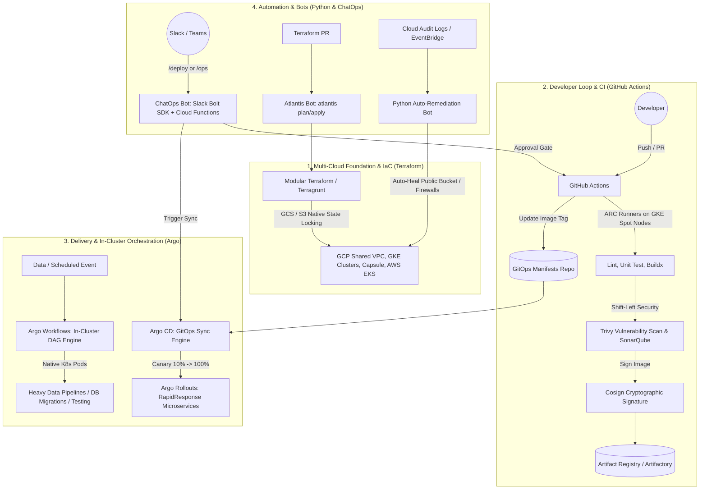
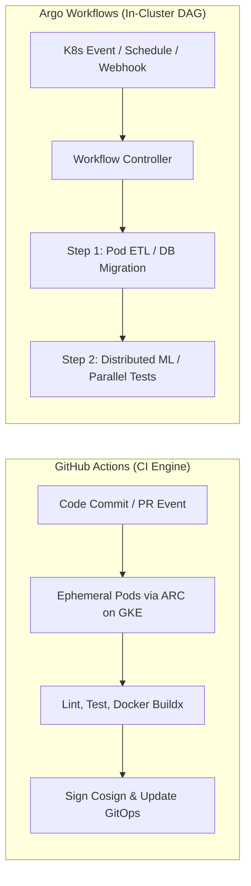
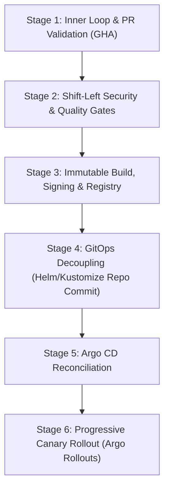

# Kinaxis — SME Level 2 Technical Round Master Guide
**Target Role:** Senior Cloud DevOps Engineer (Platform Engineering)  
**Company:** Kinaxis (RapidResponse Enterprise SaaS)  
**Topics Covered:** Terraform · Python Automation · GitHub Actions vs. Argo Workflows · Enterprise CI/CD Process · Cloud Bots & ChatOps  
**Scope:** Architecture, Production Code, Flowcharts, Kinaxis Stack Alignment & Senior Interview Defense  

---

## 🎯 Executive Narrative: Connecting the 5 Pillars

When the Kinaxis technical panel asks how these technologies fit together across their multi-cloud platform, present this unified architecture:



> **The 60-Second Interview Elevator Pitch for Kinaxis:**  
> *"In our cloud platform, **Terraform** provisions our layered multi-cloud foundation—GCP Shared VPCs, GKE clusters, and Capsule multi-tenant boundaries—enforcing strict state locking via remote backends.  
> For developers, **GitHub Actions** running on ephemeral **ARC runners inside GKE** validates pull requests, scans for CVEs, builds multi-arch containers, signs them with **Cosign**, and commits the release tag to our GitOps repository.  
> **Argo CD** continuously reconciles desired state to our clusters using **Argo Rollouts** for progressive Canary delivery, while **Argo Workflows** orchestrates heavy in-cluster data migrations and batch jobs.  
> Throughout this, **Python automation** powers our FinOps cost scrapers and ETL scripts, while **ChatOps and Atlantis bots** enable self-service PR reviews and automated security healing without anyone ever needing raw cluster-admin or cloud console credentials."*

---

# 🏛️ Pillar 1: Terraform (Production IaC Architecture)

### 1. State Management & Distributed Concurrency Under the Hood
* **How State Works:** Terraform compiles a Directed Acyclic Graph (DAG) of declared resources and compares it against `terraform.tfstate`. The state file is the ledger mapping declarative code names to physical cloud IDs (`google_container_cluster.primary` $\rightarrow$ `projects/kinaxis-prod/zones/us-central1-a/clusters/gke-rapidresponse`).
* **Remote Backend & Distributed Locking:**
  * **In Google Cloud (Kinaxis primary):** GCS buckets provide native atomic object locking. When an operation starts, Terraform places a generation lock on the state object.
  * **In AWS:** Stored in Amazon S3 (with SSE-KMS and Object Versioning enabled) paired with an **AWS DynamoDB table** containing a primary key `LockID` (String).
  * **The Failure Mode:** If Engineer B runs `terraform apply` while Engineer A's job is active, Terraform immediately halts: `Error acquiring the state lock: ConditionalCheckFailedException`. This prevents state corruption and race conditions.

```hcl
terraform {
  required_version = ">= 1.5.0"
  required_providers {
    google = {
      source  = "hashicorp/google"
      version = "~> 5.0"
    }
  }
  backend "gcs" {
    bucket = "kinaxis-tfstate-platform-prod"
    prefix = "gke/cluster-core"
  }
}
```

### 2. Workspaces vs. Directory-Per-Environment (Terragrunt)
| Dimension | Terraform Workspaces | Directory-Per-Environment (`environments/`) |
| :--- | :--- | :--- |
| **State Storage** | Single backend; states namespaced under `env:/<workspace>/` | Completely isolated buckets/keys per environment |
| **Blast Radius** | **High:** A single faulty provider or root module typo breaks all environments | **Zero:** `dev`, `staging`, and `prod` state files are physically separated |
| **RBAC / IAM** | Difficult to restrict cloud permissions per workspace | Cloud IAM strictly grants developers write access to `dev`, locking `prod` |
| **Module Versioning** | Forces all workspaces to run the same code version simultaneously | `dev` tests module `v2.0.0` while `prod` remains safely pinned to `v1.8.0` |
| **Senior Verdict** | Reserved **only** for short-lived ephemeral feature branches | **Mandatory enterprise pattern** (managed via directories or Terragrunt) |

### 3. State Surgery & Modern Refactoring Patterns
* **Declarative Import (`import {}` block in TF 1.5+):**  
  Eliminates fragile CLI-only `terraform import` commands.
  ```hcl
  import {
    to = google_compute_network.shared_vpc
    id = "projects/kinaxis-host-net/global/networks/vpc-shared-prod"
  }
  ```
  Running `terraform plan -generate-config-out=generated_vpc.tf` writes the matching HCL block automatically for code review.

* **Zero-Downtime Refactoring (`moved {}` blocks in TF 1.1+):**  
  When moving a production resource into a reusable module or renaming it, `moved {}` updates the state pointer without destroying and recreating the live resource:
  ```hcl
  moved {
    from = google_container_cluster.primary
    to   = module.gke.google_container_cluster.primary
  }
  ```

* **Production State Commands:**
  * `terraform state list`: List all resources tracked in the remote state.
  * `terraform state mv`: Rename or move resources across modules/state files.
  * `terraform state rm`: Untrack an asset without deleting the live cloud resource.
  * `terraform force-unlock <LOCK-ID>`: Release a dead lock caused by an abruptly terminated CI runner (after confirming no other job is executing).

---

# 🐍 Pillar 2: Python for Cloud & Platform Engineering

In a Senior Platform round, Python evaluation focuses on **large-scale data processing**, **cloud SDK resilience (`boto3` / `google-cloud`)**, **memory efficiency**, and **error handling**.

### 1. The 3 Production Rules of Cloud SDKs
1. **Always Use Paginators:** Never call `list_instances()` or `describe_volumes()` naked. Real enterprise accounts have thousands of resources; unpaginated calls drop results.
2. **Adaptive Retries & Exponential Backoff:** Cloud APIs enforce strict rate limits. Always configure adaptive backoff (e.g., `Config(retries={'max_attempts': 10, 'mode': 'adaptive'})`).
3. **Granular Exception Handling:** Catch vendor exceptions (such as `botocore.exceptions.ClientError` or `google.api_core.exceptions.GoogleAPICallError`) and parse error codes rather than using bare `except:`.

### 2. Large File / Log Processing: Generators vs. Memory Blowout (OOM)
> **Interview Question:** *"You have a 50GB web access log or audit trail that you need to parse in a container with only 512MB RAM. How do you do it?"*
* **The Senior Answer:**  
  *"Never use `file.read()` or `file.readlines()`, which loads the entire file into memory and triggers an Out-Of-Memory (OOM) crash. Instead, use **Python Generators** using `yield` or iterate directly over the file object (`for line in file:`), which streams the file line-by-line, maintaining an **$O(1)$ memory footprint** regardless of file size."*

```python
import gzip
from typing import Generator, Dict, Any

def stream_audit_logs(file_path: str) -> Generator[Dict[str, Any], None, None]:
    """
    Streams multi-gigabyte log files line-by-line in O(1) memory.
    """
    opener = gzip.open if file_path.endswith(".gz") else open
    with opener(file_path, "rt", encoding="utf-8") as f:
        for line in f:
            if not line.strip():
                continue
            try:
                # Example: parse space-separated or JSON log line
                timestamp, level, service, msg = line.strip().split(" ", 3)
                yield {
                    "timestamp": timestamp,
                    "level": level,
                    "service": service,
                    "message": msg
                }
            except ValueError:
                continue # Route malformed rows to Dead Letter Queue (DLQ)
```

### 3. Multi-Cloud FinOps / Stale Resource Scraper
```python
import boto3
from botocore.config import Config
from botocore.exceptions import ClientError
import logging

logging.basicConfig(level=logging.INFO, format="%(asctime)s [%(levelname)s] %(message)s")
logger = logging.getLogger("FinOpsAuditor")

def audit_unattached_disks(account_id: str, role_name: str, region: str = "us-east-1"):
    """
    Audits unattached cloud disks to eliminate zombie infrastructure spend.
    """
    sts = boto3.client("sts")
    role_arn = f"arn:aws:iam::{account_id}:role/{role_name}"
    
    try:
        assumed = sts.assume_role(RoleArn=role_arn, RoleSessionName="FinOpsAudit")
        creds = assumed["Credentials"]
    except ClientError as e:
        logger.error(f"STS AssumeRole failed: {e.response['Error']['Message']}")
        return []

    client_config = Config(retries={"max_attempts": 5, "mode": "adaptive"})
    ec2 = boto3.client(
        "ec2",
        region_name=region,
        aws_access_key_id=creds["AccessKeyId"],
        aws_secret_access_key=creds["SecretAccessKey"],
        aws_session_token=creds["SessionToken"],
        config=client_config
    )

    paginator = ec2.get_paginator("describe_volumes")
    iterator = paginator.paginate(Filters=[{"Name": "status", "Values": ["available"]}])

    orphan_vols = []
    for page in iterator:
        for vol in page.get("Volumes", []):
            orphan_vols.append({
                "VolumeId": vol["VolumeId"],
                "SizeGB": vol["Size"],
                "EstimatedMonthlyWasteUSD": round(vol["Size"] * 0.08, 2)
            })
    return orphan_vols
```

---

# ⚙️ Pillar 3: GitHub Actions vs. Argo Workflows



### Direct Architectural Comparison
| Dimension | GitHub Actions (GHA) | Argo Workflows |
| :--- | :--- | :--- |
| **Primary Domain** | **CI Engine & Automation:** Developer PR feedback, code testing, container builds, and GitOps commits. | **In-Cluster DAG Orchestration:** High-scale batch data processing, ML model pipelines, DB migrations, and complex cluster jobs. |
| **Execution Plane** | GitHub-hosted VMs or self-hosted pods via **Actions Runner Controller (ARC)** on GKE. | **100% Native Kubernetes Pods** running directly in the GKE cluster managed by the Argo Workflow Controller. |
| **Specification** | YAML in `.github/workflows/`. | Kubernetes Custom Resources (`Workflow`, `CronWorkflow`, `WorkflowTemplate`). |
| **Artifact Sharing** | Uploaded/downloaded via HTTPS to GitHub storage (inefficient for 50GB+ datasets). | Shared Kubernetes Persistent Volumes (`PVC`), direct S3/GCS bucket integration, or pod stdout/stdin pipes. |
| **Cloud Authentication** | **Workload Identity Federation (WIF) / OIDC** (`google-github-actions/auth`). No static keys! | **GKE Workload Identity** bound directly to Kubernetes ServiceAccounts. |

### How They Work Together at Kinaxis
* **GitHub Actions:** Owns the Developer Loop. When code is pushed, GHA runs unit tests, scans dependencies with Trivy, builds containers via Buildx, and commits updated image tags to the GitOps repository.
* **Argo Workflows:** Owns Heavy In-Cluster Execution. Triggered by Argo CD PreSync hooks or schedules to execute data migrations, database schema upgrades, or integration stress tests that require direct, low-latency access to in-cluster Kafka or Cloud SQL databases.

---

# 🚀 Pillar 4: End-to-End Enterprise CI/CD Process

Walk the interviewer through the **6-Stage Production Pipeline**:



### Stage 1: Inner Loop & PR Validation
* Developer pushes code to a feature branch and opens a Pull Request.
* **GitHub Actions** triggers PR validation on self-hosted **ARC runner pods**:
  * Parallel unit tests execute across matrix test suites.
  * `concurrency: cancel-in-progress: true` automatically terminates obsolete pipeline runs when new commits arrive.

### Stage 2: Shift-Left Security & Quality Gates
* **SAST (Static Analysis):** SonarQube validates code quality, enforcing an $80\%$ minimum code coverage gate.
* **SCA & Dependency Audit:** Trivy scans dependencies and container base images for Critical/High CVEs.
* **IaC Policy Enforcement:** Checkov / tfsec scans any modified Terraform code against CIS security benchmarks.

### Stage 3: Immutable Container Build, Signing & Registry
* Upon PR approval and merge to `main`:
  * **Docker Buildx** builds multi-architecture images (`linux/amd64`, `linux/arm64`) utilizing cache backends.
  * Image is tagged immutably using the short commit SHA:  
    `us-docker.pkg.dev/kinaxis-prod/apps/rapidresponse-api:sha-7f3b89a`  
    *(Never use `:latest` in production).*
  * **Supply Chain Security:** The container image is cryptographically signed using **Sigstore Cosign**, and the signature is published to Artifact Registry.

### Stage 4: GitOps Decoupling (Separation of CI and CD)
* The CI pipeline **does not possess cluster-admin or direct `kubectl` credentials**.
* Instead, GitHub Actions checks out the separate **GitOps Manifests Repository** (Kustomize / Helm) and updates the image tag:
  ```bash
  cd overlays/production
  kustomize edit set image rapidresponse-api=us-docker.pkg.dev/kinaxis-prod/apps/rapidresponse-api:sha-7f3b89a
  git commit -m "chore(release): promote rapidresponse-api to sha-7f3b89a"
  git push origin main
  ```

### Stage 5: Argo CD Reconciliation
* **Argo CD** runs inside GKE and observes the GitOps repository.
* When the new commit lands, Argo CD detects the diff (Out of Sync).
* It initiates an automated sync to apply the new Kubernetes deployment manifests.

### Stage 6: Progressive Delivery (Argo Rollouts Canary)
* Instead of a blunt rolling update, an **Argo Rollout** executes:
  1. 10% of production traffic is routed to the new canary version.
  2. An **AnalysisTemplate** queries Prometheus / Datadog every 60 seconds:
     * Condition: `http_requests_5xx_rate < 0.5%` AND `p99_latency < 250ms`.
  3. If metrics remain healthy over 5 minutes, traffic increases to 25% $\rightarrow$ 50% $\rightarrow$ 100%.
  4. If an anomaly or error spike occurs, Argo Rollouts **aborts and rolls back immediately** with zero human intervention.

---

# 🤖 Pillar 5: Explain About "Bot" (ChatOps & Automation)

In modern enterprise platform engineering, a **"Bot"** refers to three primary automated systems:

### 1. ChatOps Bots (Slack / MS Teams Command & Control)
* **Architecture:**
  ```
  Slack User (/deploy rapidresponse prod)
         │ (Outbound HTTPS POST)
         ▼
  API Gateway / Cloud Endpoint ──▶ Cloud Function / Lambda (Slack Bolt SDK)
                                         │
                            ┌────────────┴────────────┐
                            ▼                         ▼
                   Verifies Slack HMAC       Checks PagerDuty / RBAC
                   Signature                 (Is engineer on-call?)
                            │
                            ▼
                   Triggers GitHub Actions Workflow / Argo CD API
                            │
                            ▼
                   Returns Interactive Slack Card (Real-time build status & rollback buttons)
  ```
* **Production Capabilities:**
  * **Interactive Deployment Approvals:** Posts a rich Slack card requiring 2 team leads to click `[Approve]` before production traffic shifting begins.
  * **On-Call Triage Runbooks:** `/ops get-pod-logs <service>` or `/ops restart-deployment <service>`.
  * **FinOps Daily Digests:** Automated morning Slack alerts detailing previous-day cloud spend deltas and anomaly spikes.

### 2. Infrastructure PR Bots (e.g., Atlantis)
* **What it is:** An automated GitOps bot for Terraform that runs inside Kubernetes.
* **How it works:**
  1. An engineer opens a PR with Terraform modifications.
  2. The Atlantis bot catches the GitHub webhook, runs `terraform plan`, and leaves a formatted, collapsible diff comment on the PR.
  3. The bot locks the specific Terraform directory so no other PR can touch those resources simultaneously.
  4. After team code review and approval, the engineer comments `atlantis apply`.
  5. Atlantis runs `terraform apply`, merges the PR into `main`, and unlocks the workspace.
* **Why Platform Teams Love It:** Zero engineers need local cloud credentials on their laptops. All infrastructure changes have a complete audit trail in GitHub.

### 3. Event-Driven Security Auto-Remediation Bots
* **Architecture:**
  ```
  Cloud Audit Logs / AWS Security Hub
         │ (Event: "Storage Bucket Public Read Allowed")
         ▼
  Eventarc / EventBridge (Custom Rule Filter)
         │
         ▼
  Remediation Function / Lambda Bot (Python)
         ├── 1. Enforces Bucket-Level Access Control (Revokes Public ACL)
         ├── 2. Enables Default KMS Encryption
         └── 3. Dispatches Incident Alert to #secops Slack Channel
  ```
* **The Value:** Reduces **MTTR (Mean Time to Remediation)** for critical security findings from hours to sub-second automated healing.

---

## 💡 Quick Reference Kinaxis Prep Links
* Resume-Mapped Interview Stories: [[1. Resume-Mapped Interview Answers]]
* Technical Analogies & Deep Dives: [[3. Core Concepts & Analogies Guide]]
* Python ETL & Scripting Mastery: [[5. Python ETL & Scripting Mastery]]
* Argo AppSets vs. Argo Workflows: [[7. Argo ApplicationSets vs. Argo Workflows]]
* Terraform Basics & Senior Q&A: [[8. Terraform Basics & Senior Q&A Mastery]]
* RapidResponse Job Description: [[4. Job Description & Role Overview]]
