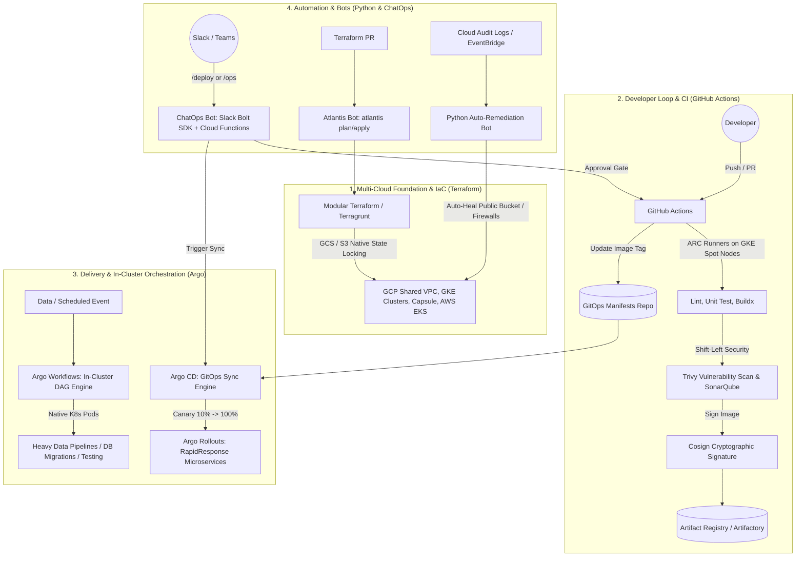
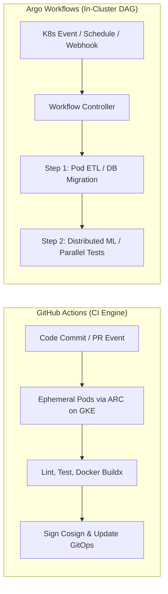
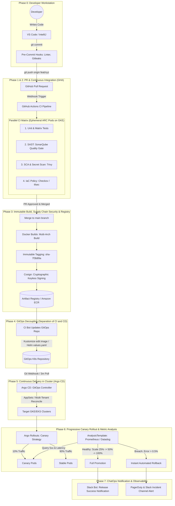

# SME Level 2 Technical Round Master Guide
**Target Role:** Senior Cloud DevOps Engineer (Platform Engineering)  
**Target:** Enterprise SaaS Platform (Multi-Cloud / High Scale)  
**Topics Covered:** Terraform · Python Automation · GitHub Actions vs. Argo Workflows · Enterprise CI/CD Process · Cloud Bots & ChatOps  
**Scope:** Architecture, Production Code, Flowcharts, Platform Stack Alignment & Senior Interview Defense  

---

## 🎯 Executive Narrative: Connecting the 5 Pillars

When the technical panel asks how these technologies fit together across their multi-cloud platform, present this unified architecture:



> **The 60-Second Interview Elevator Pitch:**  
> *"In our cloud platform, **Terraform** provisions our layered multi-cloud foundation—GCP Shared VPCs, GKE clusters, and Capsule multi-tenant boundaries—enforcing strict state locking via remote backends.  
> For developers, **GitHub Actions** running on ephemeral **ARC runners inside GKE** validates pull requests, scans for CVEs, builds multi-arch containers, signs them with **Cosign**, and commits the release tag to our GitOps repository.  
> **Argo CD** continuously reconciles desired state to our clusters using **Argo Rollouts** for progressive Canary delivery, while **Argo Workflows** orchestrates heavy in-cluster data migrations and batch jobs.  
> Throughout this, **Python automation** powers our FinOps cost scrapers and ETL scripts, while **ChatOps and Atlantis bots** enable self-service PR reviews and automated security healing without anyone ever needing raw cluster-admin or cloud console credentials."*

---

# 🏛️ Pillar 1: Terraform (Production IaC Architecture)

### 1. State Management & Distributed Concurrency Under the Hood
* **How State Works:** Terraform compiles a Directed Acyclic Graph (DAG) of declared resources and compares it against `terraform.tfstate`. The state file is the ledger mapping declarative code names to physical cloud IDs (`google_container_cluster.primary` $\rightarrow$ `projects/platform-prod/zones/us-central1-a/clusters/gke-core-platform`).
* **Remote Backend & Distributed Locking:**
  * **In Google Cloud (Target primary):** GCS buckets provide native atomic object locking. When an operation starts, Terraform places a generation lock on the state object.
  * **In AWS:** Stored in Amazon S3 (with SSE-KMS and Object Versioning enabled) paired with an **AWS DynamoDB table** containing a primary key `LockID` (String).
  * **The Failure Mode:** If Engineer B runs `terraform apply` while Engineer A's job is active, Terraform immediately halts: `Error acquiring the state lock: ConditionalCheckFailedException`. This prevents state corruption and race conditions.

```hcl
terraform {
  required_version = ">= 1.5.0"
  required_providers {
    google = {
      source  = "hashicorp/google"
      version = "~> 5.0"
    }
  }
  backend "gcs" {
    bucket = "tfstate-platform-prod"
    prefix = "gke/cluster-core"
  }
}
```

### 2. Workspaces vs. Directory-Per-Environment (Terragrunt)
| Dimension | Terraform Workspaces | Directory-Per-Environment (`environments/`) |
| :--- | :--- | :--- |
| **State Storage** | Single backend; states namespaced under `env:/<workspace>/` | Completely isolated buckets/keys per environment |
| **Blast Radius** | **High:** A single faulty provider or root module typo breaks all environments | **Zero:** `dev`, `staging`, and `prod` state files are physically separated |
| **RBAC / IAM** | Difficult to restrict cloud permissions per workspace | Cloud IAM strictly grants developers write access to `dev`, locking `prod` |
| **Module Versioning** | Forces all workspaces to run the same code version simultaneously | `dev` tests module `v2.0.0` while `prod` remains safely pinned to `v1.8.0` |
| **Senior Verdict** | Reserved **only** for short-lived ephemeral feature branches | **Mandatory enterprise pattern** (managed via directories or Terragrunt) |

### 3. State Surgery & Modern Refactoring Patterns
* **Declarative Import (`import {}` block in TF 1.5+):**  
  Eliminates fragile CLI-only `terraform import` commands.
  ```hcl
  import {
    to = google_compute_network.shared_vpc
    id = "projects/platform-host-net/global/networks/vpc-shared-prod"
  }
  ```
  Running `terraform plan -generate-config-out=generated_vpc.tf` writes the matching HCL block automatically for code review.

* **Zero-Downtime Refactoring (`moved {}` blocks in TF 1.1+):**  
  When moving a production resource into a reusable module or renaming it, `moved {}` updates the state pointer without destroying and recreating the live resource:
  ```hcl
  moved {
    from = google_container_cluster.primary
    to   = module.gke.google_container_cluster.primary
  }
  ```

* **Production State Commands:**
  * `terraform state list`: List all resources tracked in the remote state.
  * `terraform state mv`: Rename or move resources across modules/state files.
  * `terraform state rm`: Untrack an asset without deleting the live cloud resource.
  * `terraform force-unlock <LOCK-ID>`: Release a dead lock caused by an abruptly terminated CI runner (after confirming no other job is executing).

---

# 🐍 Pillar 2: Python for Cloud & Platform Engineering

In a Senior Platform round, Python evaluation focuses on **large-scale data processing**, **cloud SDK resilience (`boto3` / `google-cloud`)**, **memory efficiency**, and **error handling**.

### 1. The 3 Production Rules of Cloud SDKs
1. **Always Use Paginators:** Never call `list_instances()` or `describe_volumes()` naked. Real enterprise accounts have thousands of resources; unpaginated calls drop results.
2. **Adaptive Retries & Exponential Backoff:** Cloud APIs enforce strict rate limits. Always configure adaptive backoff (e.g., `Config(retries={'max_attempts': 10, 'mode': 'adaptive'})`).
3. **Granular Exception Handling:** Catch vendor exceptions (such as `botocore.exceptions.ClientError` or `google.api_core.exceptions.GoogleAPICallError`) and parse error codes rather than using bare `except:`.

### 2. Large File / Log Processing: Generators vs. Memory Blowout (OOM)
> **Interview Question:** *"You have a 50GB web access log or audit trail that you need to parse in a container with only 512MB RAM. How do you do it?"*
* **The Senior Answer:**  
  *"Never use `file.read()` or `file.readlines()`, which loads the entire file into memory and triggers an Out-Of-Memory (OOM) crash. Instead, use **Python Generators** using `yield` or iterate directly over the file object (`for line in file:`), which streams the file line-by-line, maintaining an **$O(1)$ memory footprint** regardless of file size."*

```python
import gzip
from typing import Generator, Dict, Any

def stream_audit_logs(file_path: str) -> Generator[Dict[str, Any], None, None]:
    """
    Streams multi-gigabyte log files line-by-line in O(1) memory.
    """
    opener = gzip.open if file_path.endswith(".gz") else open
    with opener(file_path, "rt", encoding="utf-8") as f:
        for line in f:
            if not line.strip():
                continue
            try:
                # Example: parse space-separated or JSON log line
                timestamp, level, service, msg = line.strip().split(" ", 3)
                yield {
                    "timestamp": timestamp,
                    "level": level,
                    "service": service,
                    "message": msg
                }
            except ValueError:
                continue # Route malformed rows to Dead Letter Queue (DLQ)
```

### 3. Multi-Cloud FinOps / Stale Resource Scraper
```python
import boto3
from botocore.config import Config
from botocore.exceptions import ClientError
import logging

logging.basicConfig(level=logging.INFO, format="%(asctime)s [%(levelname)s] %(message)s")
logger = logging.getLogger("FinOpsAuditor")

def audit_unattached_disks(account_id: str, role_name: str, region: str = "us-east-1"):
    """
    Audits unattached cloud disks to eliminate zombie infrastructure spend.
    """
    sts = boto3.client("sts")
    role_arn = f"arn:aws:iam::{account_id}:role/{role_name}"
    
    try:
        assumed = sts.assume_role(RoleArn=role_arn, RoleSessionName="FinOpsAudit")
        creds = assumed["Credentials"]
    except ClientError as e:
        logger.error(f"STS AssumeRole failed: {e.response['Error']['Message']}")
        return []

    client_config = Config(retries={"max_attempts": 5, "mode": "adaptive"})
    ec2 = boto3.client(
        "ec2",
        region_name=region,
        aws_access_key_id=creds["AccessKeyId"],
        aws_secret_access_key=creds["SecretAccessKey"],
        aws_session_token=creds["SessionToken"],
        config=client_config
    )

    paginator = ec2.get_paginator("describe_volumes")
    iterator = paginator.paginate(Filters=[{"Name": "status", "Values": ["available"]}])

    orphan_vols = []
    for page in iterator:
        for vol in page.get("Volumes", []):
            orphan_vols.append({
                "VolumeId": vol["VolumeId"],
                "SizeGB": vol["Size"],
                "EstimatedMonthlyWasteUSD": round(vol["Size"] * 0.08, 2)
            })
    return orphan_vols
```

---

# ⚙️ Pillar 3: GitHub Actions vs. Argo Workflows



### Direct Architectural Comparison
| Dimension | GitHub Actions (GHA) | Argo Workflows |
| :--- | :--- | :--- |
| **Primary Domain** | **CI Engine & Automation:** Developer PR feedback, code testing, container builds, and GitOps commits. | **In-Cluster DAG Orchestration:** High-scale batch data processing, ML model pipelines, DB migrations, and complex cluster jobs. |
| **Execution Plane** | GitHub-hosted VMs or self-hosted pods via **Actions Runner Controller (ARC)** on GKE. | **100% Native Kubernetes Pods** running directly in the GKE cluster managed by the Argo Workflow Controller. |
| **Specification** | YAML in `.github/workflows/`. | Kubernetes Custom Resources (`Workflow`, `CronWorkflow`, `WorkflowTemplate`). |
| **Artifact Sharing** | Uploaded/downloaded via HTTPS to GitHub storage (inefficient for 50GB+ datasets). | Shared Kubernetes Persistent Volumes (`PVC`), direct S3/GCS bucket integration, or pod stdout/stdin pipes. |
| **Cloud Authentication** | **Workload Identity Federation (WIF) / OIDC** (`google-github-actions/auth`). No static keys! | **GKE Workload Identity** bound directly to Kubernetes ServiceAccounts. |

### How They Work Together in Enterprise Platform Engineering
* **GitHub Actions:** Owns the Developer Loop. When code is pushed, GHA runs unit tests, scans dependencies with Trivy, builds containers via Buildx, and commits updated image tags to the GitOps repository.
* **Argo Workflows:** Owns Heavy In-Cluster Execution. Triggered by Argo CD PreSync hooks or schedules to execute data migrations, database schema upgrades, or integration stress tests that require direct, low-latency access to in-cluster Kafka or Cloud SQL databases.

---

# 🚀 Pillar 4: End-to-End Enterprise CI/CD Process (Start to End)

When the interviewer asks: *"Explain your CI/CD setup entirely from start to end,"* walk them through this exact **7-Phase Lifecycle**, from a developer typing on their laptop to a production canary rollout and rollback:



### The 7 Granular Phases Walkthrough

#### Phase 0: Developer Inner Loop & Workstation
1. Developer writes code locally in Python, Go, or Java.
2. **Local Pre-Commit Hook:** Executes automatically via the `.pre-commit-config.yaml` framework before git allows the commit:
   * Formatter/Linter: `black`, `flake8`, or `golangci-lint`.
   * Secret Scanner: `gitleaks` or `trufflehog` to guarantee private keys or cloud tokens are never committed.
   * YAML/JSON validator.

#### Phase 1 & 2: Pull Request & Continuous Integration (GitHub Actions)
1. Developer opens a Pull Request against `main`.
2. GitHub sends a webhook event to **Actions Runner Controller (ARC)** hosted inside our private GKE cluster. ARC spins up an ephemeral runner pod on EC2/GCP Spot instances.
3. The CI Pipeline executes 4 parallel verification jobs:
   * **Unit Tests & Code Coverage:** Matrix execution across language versions, enforcing an $80\%$ minimum coverage gate.
   * **SAST (Static Application Security Testing):** SonarQube analyzes code quality, technical debt, and security vulnerabilities.
   * **SCA (Software Composition Analysis):** **Trivy** scans `package-lock.json` / `requirements.txt` against CVE databases.
   * **IaC Policy Validation:** If Terraform manifests are touched, **Checkov** validates against CIS Benchmarks (e.g., verifying no open security groups or unencrypted storage).
4. **Concurrency Control:** `concurrency: cancel-in-progress: true` automatically kills running pipelines if the developer pushes a new commit to the PR, saving CI minutes.

#### Phase 3: Immutable Container Build, Signing & Registry
1. PR is peer-reviewed, approvals are logged, and code is merged to `main`.
2. **Docker Buildx:** Compiles multi-architecture images (`linux/amd64`, `linux/arm64`) using GitHub Actions layer caching.
3. **Immutable Tagging:** Never tag production images as `:latest`. The image is tagged strictly with the short commit SHA:
   `us-docker.pkg.dev/platform-prod/apps/platform-core:sha-9a4f21c`
4. **Supply Chain Security:** The pipeline uses **Sigstore Cosign** with Workload Identity Federation (WIF) to cryptographically sign the container image without managing long-lived private keys. The signature is pushed alongside the image to Google Artifact Registry.

#### Phase 4: The GitOps Decoupling (Separation of CI and CD)
* **The Security Principle:** The CI pipeline **does not possess `kubectl` access or cluster admin credentials**. If CI runners are compromised, production clusters remain completely unbreachable.
* Instead, the CI workflow checks out the separate **GitOps Repository** (where Helm charts or Kustomize overlays live) and updates the image tag:
  ```bash
  cd overlays/production
  kustomize edit set image rapidresponse-core=us-docker.pkg.dev/platform-prod/apps/platform-core:sha-9a4f21c
  git commit -m "chore(release): promote rapidresponse-core to sha-9a4f21c"
  git push origin main
  ```

#### Phase 5: Continuous Delivery in Cluster (Argo CD)
1. **Argo CD** runs inside the Kubernetes cluster and continuously monitors the GitOps repository.
2. Upon detecting the commit, Argo CD identifies an `OutOfSync` state.
3. **ApplicationSets:** If managing multiple clusters/tenants (Dev, Staging, Prod-US, Prod-EU), the ApplicationSet Generator automatically stamps out and updates the deployment across all target clusters.
4. **Automated Drift Self-Healing:** If someone runs `kubectl edit` manually in the cluster, Argo CD detects the drift within seconds and immediately reverts the cluster back to the declared Git state (`selfHeal: true`).

#### Phase 6: Progressive Canary Rollout & Metric Analysis (Argo Rollouts)
Instead of a dangerous all-at-once rolling deployment, an **Argo Rollout Canary** executes:
1. **10% Traffic Split:** Ingress routes 10% of real user traffic to the new Canary pods while 90% stays on Stable.
2. **AnalysisTemplate Verification:** Argo Rollouts queries Prometheus / Datadog every 60 seconds:
   * Metric 1: HTTP 5xx error rate $< 0.5\%$.
   * Metric 2: P99 latency $< 250\text{ ms}$.
3. **Step-by-Step Promotion:** If healthy over 5 minutes, traffic steps up: $10\% \rightarrow 25\% \rightarrow 50\% \rightarrow 100\%$.
4. **Automated Rollback:** If the error rate spikes above $0.5\%$ at any step, Argo Rollouts aborts instantly, shifts 100% of traffic back to the old Stable pods, and deletes the faulty Canary pods. Zero human intervention required!

#### Phase 7: Post-Deployment Observability & ChatOps Notification
1. If successful, our **ChatOps Bot** sends a formatted release card to `#platform-announcements` on Slack with deployment duration and Git commit details.
2. If failed/rolled back, PagerDuty triggers an alert, and an incident card is posted to `#incident-room` with Prometheus error metrics and pod logs.

---

# 🤖 Pillar 5: Deep Dive: How the Bot Worked at ADP

When asked: *"How did your bot work at ADP? What language did it use, and how did it communicate with your apps and tools?"* — use this detailed architectural breakdown.

```mermaid
flowchart TD
    subgraph UI ["1. User & Event Interfaces"]
        USER((Developer / On-Call)) -->|Slack Slash Command / Modal| SLACK[Slack API: /sandbox or /remediate]
        ALERT[Datadog / EventBridge Alert] -->|Webhook POST| API_GW[AWS API Gateway / Cloud Endpoints]
        SLACK -->|Signed HTTPS POST| API_GW
    end

    subgraph ENGINE ["2. Bot Engine (Python & Go)"]
        API_GW --> AUTH[HMAC Signature Verification & RBAC Validator]
        AUTH --> ROUTER[FastAPI / Lambda Dispatcher]
        
        ROUTER --> WORKER1[Worker 1 (Python): Self-Service Sandbox Provisioner]
        ROUTER --> WORKER2[Worker 2 (Python): OS Remediation & Node Healer]
        ROUTER --> WORKER3[Worker 3 (Go): High-Concurrency Event Logger]
    end

    subgraph INTEGRATIONS ["3. Apps & Tool Integrations (REST APIs & SDKs)"]
        WORKER1 -->|REST API (OAuth)| JIRA[Jira / ServiceNow: Change Request Audit]
        WORKER1 -->|AppRole Auth| VAULT[HashiCorp Vault: Ephemeral DB/Cloud Secrets]
        WORKER1 -->|Boto3 / Cloud SDK| CLOUD[AWS / GCP APIs: VPC, Subnet, RDS, EIP]
        
        WORKER2 -->|SSH / WinRM / SSM| NODES[Worker Nodes: Disk Cleanup, Log Rotate, Service Restart]
        WORKER2 -->|K8s Python Client| K8S[Kubernetes API: Evict Pod, Cordon Node]
        
        WORKER3 -->|REST API| ARGOCD[Argo CD API: Trigger Sync / Check Health]
        WORKER3 -->|SQL / Webhook| REDASH[Redash / Datadog: Release Dashboard Telemetry]
    end
```

### 1. Which Languages Were Used & Why?
* **Primary Language: Python 3.10+ (85% of logic)**
  * **Why Python?** Rich ecosystem for infrastructure SDKs (`boto3`, `google-cloud`, `kubernetes` client), HTTP integrations (`requests`, `httpx`), and the **Slack Bolt for Python** framework. It allowed fast iteration and clean declarative scripts.
  * **Framework:** **FastAPI** running inside AWS Lambda / Cloud Functions behind an API Gateway, or running as a lightweight container pod in Kubernetes.
* **Secondary Language: Golang (15% of logic)**
  * **Why Go?** Used specifically for the **high-throughput event ingestion engine and release logger**. When 50 microservices emitted real-time deployment and test events concurrently, Python had thread-blocking overhead; Go's lightweight goroutines handled thousands of concurrent webhook streams with sub-millisecond latency and tiny memory usage ($<30\text{MB}$ RAM).

---

### 2. How the Bot Communicated with Apps and Tools (Integration Protocols)

| Target App / Tool | Communication Protocol | Authentication / Security | Actions Performed by the Bot |
| :--- | :--- | :--- | :--- |
| **Slack (ChatOps)** | HTTPS Webhooks & Slack Bolt SDK | **HMAC-SHA256 signature verification** (`X-Slack-Signature` & `X-Slack-Request-Timestamp`) | Accepts `/sandbox` and `/remediate` commands; renders interactive approval buttons; streams real-time status updates back to channels. |
| **Jira / ServiceNow** | REST API v3 / v2 over HTTPS | OAuth 2.0 / Service Account API Tokens | Checks if an approved Change Request (`CHG-xxxx`) exists before executing prod operations; automatically logs audit comments with execution timestamps. |
| **AWS / GCP Cloud** | AWS SDK (`boto3`) & Google Cloud Client Libraries | **STS `AssumeRole`** / Workload Identity Federation (Zero static keys) | Provisions isolated sandboxes, manages Security Groups, rotates Elastic IPs, cleans orphan EBS disks, and adjusts auto-scaling groups. |
| **Kubernetes API** | `kubernetes` Python Client / REST API | In-Cluster ServiceAccount Token (`Bearer`) via K8s RBAC | Creates ephemeral tenant namespaces, applies ResourceQuotas, cordons bad nodes, restarts crashed deployments, and fetches pod logs. |
| **Argo CD** | Argo CD REST API (`/api/v1/applications`) | JWT Bearer Token generated via Argo CD Service Account | Queries application sync status, triggers manual sync on demand, and pauses or initiates rollbacks. |
| **HashiCorp Vault** | HTTP REST API / `hvac` Python library | **AppRole Authentication** (`role_id` + `secret_id`) | Retrieves short-lived dynamic cloud credentials and database connection strings into memory (`tmpfs`); never written to disk. |
| **Operating Systems (Linux/Windows)** | AWS Systems Manager (SSM) Run Command / Ansible over SSH & WinRM | IAM Instance Profile / Kerberos credentials | Performs automated OS remediation: cleans `/var/log` or `/tmp` when disk $>85\%$, truncates bloated logs, and restarts hung `systemd` daemons. |
| **Redash & Datadog** | HTTPS REST API / DogStatsD UDP | API Key & Application Key | Pushes release execution events, sandbox provisioning latency metrics, and automated remediation counters to executive dashboards. |

---

### 3. The Two Concrete Bot Implementations at ADP

#### Bot A: The Self-Service Sandbox Provisioner ("ATM Bot")
* **The Problem:** Non-production sandbox environments (isolated namespaces with dedicated DB stubs and mock gateways) took **2 to 3 days** of manual ticket ping-pong between Dev, NetOps, and Cloud teams.
* **The Bot Workflow:**
  1. A developer types `/sandbox create --tier=microservice --name=billing-test --ttl=7d` in Slack.
  2. The bot verifies user identity and team membership against Okta/LDAP.
  3. The bot calls **Vault** to generate temporary credentials, calls **Kubernetes API** to create a namespaced sandbox with CPU/memory limits, and calls **Terraform / AWS API** to provision ephemeral RDS/S3 resources.
  4. The bot posts a message back to the developer with the kubeconfig context and access URLs within **8 minutes**.
  5. An automated cron monitors the TTL: on day 7, the bot sends a Slack reminder, and tears down the sandbox if not extended, preventing zombie cloud costs.
* **Business Impact:** Reduced environment lead time from **2 days to $<10$ minutes**.

#### Bot B: BotOps & Automated OS / Platform Remediation
* **The Problem:** On-call engineers were constantly woken up at 2 AM for trivial, repeatable operational alerts: `/var/log` disk full on worker nodes, hung Java processes, or stale network sockets.
* **The Bot Workflow:**
  1. Datadog or AWS EventBridge detects an alert: `"Node i-0a8b9c: /var/log filesystem usage exceeds 88%"`.
  2. EventBridge sends a webhook to our Remediation Bot API.
  3. The bot executes an automated remediation playbook via **AWS SSM Run Command**:
     * Truncates rotated `.gz` log files older than 3 days.
     * Cleans up Docker/containerd dangling layers (`crictl rmi --prune`).
     * Verifies disk utilization dropped below $60\%$.
  4. If disk is healthy, the bot resolves the Datadog alert automatically and logs an audit card to `#ops-bot-remediations`.
  5. If disk is still full after automated cleanup, the bot escalates and pages the human on-call engineer with pre-collected diagnostic output (`df -h`, `lsof`).
* **Business Impact:** Eliminated **60% of repetitive on-call operational toil** and reduced MTTR for common infrastructure glitches from 45 minutes to under 30 seconds.

---

### 4. Code Architecture Snippet: Slack Bolt HMAC & Tool Dispatcher
```python
import os
import hmac
import hashlib
import time
from fastapi import FastAPI, Request, HTTPException, Header, BackgroundTasks
import boto3

app = FastAPI(title="ADP Platform Bot Engine")
SLACK_SIGNING_SECRET = os.environ.get("SLACK_SIGNING_SECRET")

def verify_slack_signature(raw_body: bytes, timestamp: str, signature: str) -> bool:
    """Verifies that the incoming request genuinely originated from Slack."""
    if abs(time.time() - int(timestamp)) > 60 * 5:
        return False  # Replay attack prevention
    sig_basestring = f"v0:{timestamp}:{raw_body.decode('utf-8')}".encode("utf-8")
    my_sig = "v0=" + hmac.new(SLACK_SIGNING_SECRET.encode(), sig_basestring, hashlib.sha256).hexdigest()
    return hmac.compare_digest(my_sig, signature)

def execute_os_disk_remediation(instance_id: str):
    """Executes automated disk remediation via AWS Systems Manager (SSM)."""
    ssm = boto3.client("ssm", region_name="us-east-1")
    remediation_script = [
        "journalctl --vacuum-time=2d",
        "find /var/log -type f -name '*.gz' -mtime +2 -delete",
        "crictl rmi --prune"
    ]
    ssm.send_command(
        InstanceIds=[instance_id],
        DocumentName="AWS-RunShellScript",
        Parameters={"commands": remediation_script},
        Comment="Automated BotOps Disk Remediation"
    )

@app.post("/api/bot/command")
async def handle_bot_command(
    request: Request,
    background_tasks: BackgroundTasks,
    x_slack_request_timestamp: str = Header(...),
    x_slack_signature: str = Header(...)
):
    body_bytes = await request.body()
    if not verify_slack_signature(body_bytes, x_slack_request_timestamp, x_slack_signature):
        raise HTTPException(status_code=401, detail="Invalid Slack signature")

    form_data = await request.form()
    command = form_data.get("command")
    text = form_data.get("text", "")
    user_name = form_data.get("user_name")

    if command == "/remediate-node":
        instance_id = text.strip()
        background_tasks.add_task(execute_os_disk_remediation, instance_id)
        return {
            "response_type": "ephemeral",
            "text": f"🛠️ Initiated automated disk cleanup on `{instance_id}` for @{user_name}. Check #ops-bot for verification status."
        }
    
    return {"text": f"Command `{command}` recognized."}
```

---

## 💡 Quick Reference Platform Prep Links
* Resume-Mapped Interview Stories: [[1. Resume-Mapped Interview Answers]]
* Technical Analogies & Deep Dives: [[3. Core Concepts & Analogies Guide]]
* Python ETL & Scripting Mastery: [[5. Python ETL & Scripting Mastery]]
* Argo AppSets vs. Argo Workflows: [[7. Argo ApplicationSets vs. Argo Workflows]]
* Terraform Basics & Senior Q&A: [[8. Terraform Basics & Senior Q&A Mastery]]
* RapidResponse Job Description: [[4. Job Description & Role Overview]]
